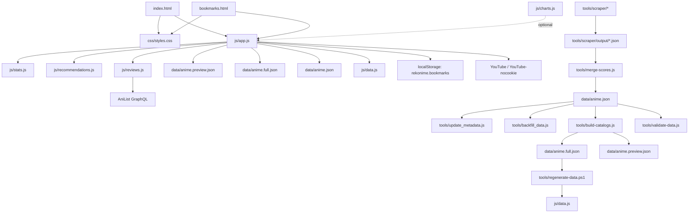

# Rekonime Agent Guide

## Mandatory skills and workflow
- Always check the `skills/` folder at the start of a task.
- Always apply the instructions in `skills/ATOM-OF-THOUGHT.md` for every coding task.
- For UI or design work (layouts, styling, components, or visual changes), also apply:
  - `skills/FRONTEND-DESIGN.md`
  - `skills/FRONTEND-RESPONSIVE-UI.md`

## Graph-based Codebase Context (nodes and edges)

### Nodes (files and modules)
- `index.html`: Main catalog page, SEO meta, CSP, and script/style includes.
- `bookmarks.html`: Bookmarks page, shares the same JS/CSS and detail modal.
- `css/styles.css`: Global styles, component layouts, animations, and responsive rules.
- `js/app.js`: Central controller for state, rendering, filtering, search, modals, SEO, and bookmarks.
- `js/stats.js`: Retention and scoring metrics. Builds score profiles and per-anime stats.
- `js/recommendations.js`: Recommendation, badges, sorting options, and similarity scoring.
- `js/reviews.js`: AniList GraphQL review fetch + rendering + synopsis utilities.
- `js/charts.js`: Chart.js helpers (not wired in current HTML).
- `js/data.js`: Embedded fallback dataset (`ANIME_DATA`) for `file://` and fetch failure.
- `data/anime.json`: Raw catalog (scraped). Source of truth for builds.
- `data/anime.full.json`: Full catalog with stats + colorIndex (generated).
- `data/anime.preview.json`: Preview subset for fast first paint (generated).
- `tools/*.js` and `tools/*.ps1`: Data pipeline utilities.
- `tools/scraper/*`: Python scraper + metadata enrichers for MAL/Jikan/AniList.

### Edges (dependencies and relationships)
- `index.html` -> `css/styles.css`
- `index.html` -> `js/stats.js` -> `js/recommendations.js` -> `js/reviews.js` -> `js/app.js`
- `bookmarks.html` -> same JS/CSS stack as `index.html`
- `js/app.js` -> `Stats` (calculations) + `Recommendations` (badges/recs/similar/sort options)
- `js/app.js` -> `ReviewsService` (synopsis + review tabs in detail modal)
- `js/app.js` -> localStorage (`rekonime.bookmarks`) for saved anime
- `js/app.js` -> `data/*.json` (fetch preview/full/legacy) and `js/data.js` fallback
- `js/reviews.js` -> AniList GraphQL (`https://graphql.anilist.co`)
- `js/app.js` -> YouTube (trailer links and embeds, sanitized to allowed hosts)
- `tools/build-catalogs.js` -> `js/stats.js` (precompute stats) -> `data/anime.full.json` + `data/anime.preview.json`
- `tools/regenerate-data.ps1` -> `data/anime.full.json` -> `js/data.js`
- `tools/merge-scores.js` -> `tools/scraper/output/*.json` -> `data/anime.json`
- `tools/update_metadata.js` -> Jikan API -> `data/anime.json`
- `tools/backfill_data.js` -> AniList + MAL HTML scraping -> `data/anime.json`
- `tools/validate-data.js` -> `data/anime.json` (+ optional embedded data check)

## Runtime flows (high-signal paths)

### Initial load and data swap
1. `App.init()` renders loading state and loads bookmarks.
2. `App.loadInitialData()` fetches `data/anime.preview.json` (or `ANIME_DATA` for `file://`).
3. `App.applyCatalogPayload()` normalizes data, ensures stats, extracts filters, renders UI.
4. `App.loadFullCatalog()` swaps in `data/anime.full.json` (or `data/anime.json` legacy) and re-renders.

### Filtering and sorting
- Filters are stored in `App.activeFilters` and options in `App.filterOptions`.
- `App.applyFilters()` produces `App.filteredData`, resets pagination, and re-renders.
- Active filters sync to URL query params (season/year/genre/theme/etc.) for shareable states and are restored on load/history.
- Sorting uses `Recommendations.getSortOptions()` + `App.sortAnimeByMetric()`.

### Search
- `App.handleHeaderSearch()` matches against `anime.searchText` (built or derived).
- Selecting a result triggers `data-action="open-anime"` -> `App.showAnimeDetail()`.

### Detail modal and deep linking
- `App.showAnimeDetail()` renders modal, updates URL (`?anime=...`), and sets SEO meta.
- `App.syncModalWithUrl()` opens/closes modal on back/forward navigation.
- Modal sections include synopsis, trailer, reviews, and similar anime.

### Reviews and synopsis
- `ReviewsService.fetchReviews()` calls AniList GraphQL.
- Reviews are categorized and rendered with tabs. Synopsis uses AniList or fallback.
- Descriptions are cached in localStorage for 30 days.

### Similar anime
- `Recommendations.getSimilarAnime()` requires at least one shared genre and theme.
- Similarity score blends tag overlap with retention + satisfaction alignment.

### Bookmarks
- Stored in localStorage under `rekonime.bookmarks`.
- `bookmarks.html` renders via `App.renderBookmarks()` using the same card renderer.

### Trailer autoplay
- `App.renderTrailerSection()` builds sanitized YouTube URLs.
- `App.setupTrailerAutoplay()` uses IntersectionObserver + scroll fallback.

## Data schema (core entities)

### Catalog payload
- `generatedAt`: ISO timestamp.
- `scoreProfile`: `{ p35, p50, p65, sampleSize?, source? }`
- `anime`: Array of Anime objects.

### Anime object (normalized)
- `id`, `title`, `titleEnglish`, `titleJapanese`
- `malId`, `anilistId`
- `cover`, `type`, `year`, `season`, `studio`, `source`, `demographic`
- `genres[]`, `themes[]`
- `synopsis`, `trailer` (YouTube info)
- `communityScore` (MAL satisfaction)
- `searchText` (lowercased, normalized query string)
- `episodes[]` (each `{ episode, score }`)
- `stats` (computed if missing)
- `colorIndex`

### Stats object (detailed)
- `average`: Mean episode score (1-5).
- `stdDev`: Standard deviation of episode scores (lower is more consistent).
- `auc`: Overall score normalized to 0-100 with a strictness curve.
- `consistency`: `{ label, class }` from `stdDev` buckets.
- `scoreClass`: CSS class derived from `average`.
- `episodeCount`: Count of scored episodes.
- `highestScore`: Max episode score (1-5).
- `lowestScore`: Min episode score (1-5).
- `retentionScore`: 0-100 blend of hook, drop safety, momentum, and flow; opening weight scales down for long series and slow-burn can lift.
- `malSatisfactionScore`: MAL community score (0-10) copied from `communityScore`.
- `reliabilityScore`: 0-100; hook + session safety + low churn risk + habit safety (scaled for long series).
- `sessionSafety`: 0-100; percent of episodes above a safety floor, blended with overall quality.
- `threeEpisodeHook`: 0-100; strictness-adjusted average of first 3 episodes.
- `habitBreakRisk`: 0-10; longest chain of below-median episodes per 10 eps.
- `peakScore`: Highest episode score (1-5).
- `finaleStrength`: 0-100 (50 is neutral); compares final quarter vs earlier episodes.
- `worthFinishing`: 0-100; finale strength + momentum + narrative acceleration.
- `peakEpisodeCount`: Count of perfect 5/5 episodes.
- `momentum`: -100 to 100; last 3 episodes vs overall average.
- `narrativeAcceleration`: Linear regression slope for second half (can be negative).
- `comfortScore`: 0-100; flow + emotional stability + entry ease + low stress spikes.
- `stressSpikes`: 0-10; count of >= 1.5 point drops per 10 episodes.
- `emotionalStability`: 0-100; higher when episode-to-episode changes are smaller.
- `barrierToEntry`: Std dev of first 5 episodes (lower is easier to get into).
- `flowState`: 0-100; inverse of squared episode-to-episode swings.
- `qualityTrend`: `{ slope, direction }` with direction in `improving|declining|stable`.
- `qualityDips`: Array of `{ episode, score, deviation }` for dips >= 0.8 below series average.
- `productionQualityIndex`: 0-100; average + consistency + trend + hook + low churn risk minus dip penalty.
- `rollingAverage`: Array of `{ episode, rollingAvg }` with window size 3.
- `controversyPotential`: 0-100; range plus extreme-score bonus.
- `sharkJump`: `{ episode, dropAmount }` if a permanent rolling-average drop; otherwise `null`.
- `churnRisk`: `{ score, label, factors }` with score 0-100 and label buckets.
- `slowBurn`: `{ signal, isActive, momentumScore, finaleStrength }` for slow-burn indicator.
- Note: Most 0-100 metrics use a strictness curve (`Stats.strictnessExponent`) to emphasize stronger signals.

## DOM contract (IDs and data-action)
- Key IDs: `#anime-grid`, `#recommendations-grid`, `#best-ranking-1`, `#best-ranking-2`,
  `#filter-modal`, `#filter-sections`, `#active-filters`, `#header-search`,
  `#detail-modal`, `#detail-content`, `#community-reviews-section`, `#similar-anime-section`,
  `#bookmarks-section`, `#bookmarks-grid`.
- `data-action` values used by delegation: `open-anime`, `toggle-filter`, `toggle-bookmark`, `load-more`.
- Image fallbacks: use `data-fallback-src` on `img` tags.

## CSS architecture and responsive rules
- `css/styles.css` contains a base section and a later "Beginner-friendly UX refresh" section.
  The refresh block redefines `:root` variables and overrides earlier selectors.
- Theme tokens live in the refresh `:root` block (dark palette, radii, shadows).
- Breakpoints in use: `max-width: 960px` and `max-width: 640px` (primary),
  plus older `max-width: 768px` and `max-width: 480px` rules earlier in the file.
  Prefer existing breakpoints; avoid inventing new ones.

## External services and security constraints
- CSP in `index.html` and `bookmarks.html` restricts remote sources:
  - Fonts: Google Fonts
  - Reviews: AniList GraphQL
  - Trailers: YouTube / YouTube-nocookie
- URL sanitization is enforced in `App` and `ReviewsService` for images and trailers.
- If adding new remote assets or APIs, update CSP accordingly.

## Data pipeline graph (tools)
1. `tools/scraper/mal_scraper.py` -> `tools/scraper/output/*.json`
2. `tools/merge-scores.js` -> `data/anime.json`
3. `tools/update_metadata.js` and `tools/backfill_data.js` enrich `data/anime.json`
4. `tools/build-catalogs.js` -> `data/anime.full.json` + `data/anime.preview.json`
5. `tools/regenerate-data.ps1` -> `js/data.js` (embedded fallback)
6. `tools/validate-data.js` checks required fields (use `--skip-embedded` if needed)

## Notes on optional modules
- `js/charts.js` requires Chart.js (+ ChartDataLabels) and is not included in HTML.
  If you use it, wire scripts and canvas IDs in the page.

## Maintenance (keep this file adaptive)
- Treat this file as living documentation: update nodes, edges, flows, and schemas when code changes.
- When adding/removing files or data flows, reflect the change in both the graph section and the flowchart below.
- Keep sections concise and editable; prefer short bullets over long prose.

## Flowchart (end-to-end codebase view)

