# Rekonime

Rekonime is a static, browser-based anime dashboard that highlights how likely a show is to keep viewers watching, paired with community satisfaction. Each title has a detailed modal with scores, synopsis, trailers, and reviews.

## Quick start

Use Node.js 24.x and Bun. The Node version is declared in `.nvmrc` for local version managers and CI, and in `package.json` for Vercel builds.

1. Install dependencies: `bun install`
2. Run local dev server: `bun run dev`
3. Optional: install git hooks for pre-commit/pre-push checks:
   - `bun run hooks:install`

## What you can do
- Browse and filter a large anime catalog.
- Compare episode rating strength, rating coverage, and community scores. These are rating signals, not completion probabilities.
- Get recommendations and similar-anime matches.
- Track your watchlist (planned/watching/completed/dropped) stored locally in your browser.
- **Surprise Me**: Get a random quality anime recommendation.
- **Seasonal Discovery**: Quick filters for This Season, Last Season, Next Season.
- **Trending**: See what's popular right now.
- **Because You Watched**: Personalized recommendations based on your watchlist.
- **Filter Presets**: One-click curated filters (Binge-Worthy, Critical Darlings, Hidden Gems, etc.).
- **Keyboard Shortcuts**: `?` for help, `/` for search, arrow keys for navigation.
- **Themes**: Switch between Dark, Light, or Auto (OS preference) modes.
- **Offline Support**: Works offline with cached data via Service Worker.

## Data and updates (human view)
- Source data lives in `data/anime.json`.
- The app loads the full runtime index (`dist/data/anime.full.index.json`) for browsing. Search variants are prepared from the title fields in the browser.
- Production builds emit per-title detail chunks (`dist/data/anime.detail/*.json`), addressed by encoded anime ID. Detail views and the MyAnimeList XML parser/planner load their JavaScript on demand.
- A compact fallback dataset is embedded in `public/js/data.js` for `file://` browsing and fetch failures.

Use `bun tools/refresh-season-scores.js --date 2026-10-04 --dry-run` to confirm the Fall 2026 and Summer 2026 targets. Remove `--dry-run` to refresh scores and rebuild the catalogs. Both seasonal and whole-catalog refreshes default to MyAnimeList directly for community scores and episode scores. No Jikan requests or startup probes are made in the default `mal` mode.

To refresh the whole catalog, run `bun run data:refresh-scores`. Both refresh commands default to one anime worker and at least 10 seconds between MAL requests. Community scores, episode pagination, and retries share the same MAL queue. A full refresh can take many hours. Run only one refresh process at a time; queues are shared within a process, not across separate runs.

Rate limiting pauses all queued requests to that provider for at least 60 seconds, respects `Retry-After` seconds or dates, and slows subsequent requests. Repeated rate limits, access-denied responses, or detected security challenges stop the run without attempting a score fallback. Temporary network/server failures use bounded exponential retries; other HTTP errors are not retried.

The optional `--score-source auto` flag retains the old Jikan-first behavior with 3-second Jikan pacing and a MAL fallback. Only in this explicitly selected mode, five consecutive Jikan connection/server failures disable Jikan for that process. Default runs always use MAL. Network retry messages include the error code when available.

Progress is saved every 25 anime and when the run stops on protection or receives Ctrl+C. Existing scores survive failed requests. After a stop, wait until provider access is restored, then repeat the command with the printed `--start-index`, preserving the original data path, filters, and seasonal `--date`. The index starts at the earliest unsuccessful or unfinished title, so some later completed titles can be revisited when using multiple workers. A stopped seasonal run does not rebuild catalogs. After completing a whole-catalog refresh, run `bun run data:build` and `bun run data:regenerate` to update the app's derived data.

Use `--mal-delay-ms 15000` for an even slower run. The existing delay, concurrency, save-interval, and selection flags remain available.

For imports and other data changes:

1) Update or merge source data in `data/anime.json`.
2) Build the preview/full catalogs:
   - `bun run data:build`
     - Optional: `--report` writes a quality report. Override its location with `--report-path <path>`.
     - Optional: `--incremental` uses `.build-state.json` to skip unchanged builds. Override its location with `--state <path>`.
3) Regenerate the compact embedded fallback:
   - `bun run data:regenerate`
4) Run golden and validation checks:
   - `bun run test:golden`
   - `bun run data:validate`

## Validation workflow
Run these before opening a PR:
1. `bun run test:unit`
2. `bun run test:integration`
3. `bun run test:golden`
4. `bun run data:validate`
5. `bun run test:coverage`
6. `bun run check:security`

Useful grouped commands:
- `bun run check:quick` (unit + integration + data validation)
- `bun run data:validate:strict` (raw validator with no baseline allowances)
- `bun run data:regenerate` (regenerate the compact embedded fallback through a Python-capable launcher)
- `bun run test:runtime` (runtime-focused tests)
- `bun run test:services` (service-layer tests)
- `bun run test:scraper` (Python scraper host-policy regressions)
- `bun run test:tools` (pipeline/tooling tests)
- `bun run test:unit:watch` (watch-mode unit tests)
- `bun run check:repo-hygiene` (detect tracked generated artifacts)
- `bun run check:outdated-budget` (dependency update budget + exceptions)
- `bun run check:unsafe-patterns` (static unsafe API pattern scan)
- `bun run check:security-headers` (verifies required security headers in `vercel.json`)

`bun run test:coverage` uses Bun's native coverage gate from `bunfig.toml`.

Reference docs:
- CI/local command matrix: `docs/ci-local-matrix.md`
- Security release checklist: `docs/release-security-checklist.md`
- Data quality incident playbook: `docs/data-quality-incident-playbook.md`
- Dependency lifecycle policy: `docs/dependency-lifecycle.md`
- Module and event contracts: `docs/module-contracts.md`, `docs/event-contracts.md`

## Project layout

```text
src/
  app/                   Page entry points, app shell, bootstrap
  features/
    airing/              Release schedules and airing dashboard
    catalog/             Catalog loading, cache, payload validation
    detail/              Detail views, trailers, community reviews
    discovery/           Browse filters, scoring, recommendations, intent
    onboarding/          First-time welcome journey
    preferences/         Taste profile and personal data restore
    watchlist/           Saved entries, lifecycle, import, page rendering
      contracts/         Watchlist types and events
  shared/
    runtime/             Browser capabilities, images, health, worker registration
    security/            URL policies and Trusted Types
    services/            Cache manager and logging
    ui/                  Theme, sidebar, keyboard shortcuts, toast
  styles/                Page and shared stylesheets
public/                  Files served directly, including fonts and fallback data
data/                    Source and derived catalogs
test/                    Unit, integration, contract, and browser tests
tools/                   Build checks, data pipeline, and scraper
docs/                    Contracts, ownership, operations, and design QA
plans/                   Feature specifications and implementation tickets
```

Start a feature change in its `src/features/` folder. Keep page bootstrapping in
`src/app/`, and put code used across features in the appropriate `src/shared/`
folder. Import modules directly; no barrel files or path aliases are required.
Tests keep their existing `test/` layout and package commands.

The root HTML files are Vite page entries. Vite compiles `src/` into the existing
production `/js/` and `/css/` URLs and copies `public/` files as-is. Edit source
files rather than `dist/`, which is generated by `bun run build`.
`public/js/data.js` is generated by `bun run data:regenerate`.

The icon font in `public/fonts/phosphor-icons.woff2` contains only the glyphs in
`src/styles/phosphor-icons.css`. After adding an icon, install `fonttools[woff]`
in a Python environment and run `python tools/subset-icons.py`. The original font
is kept in `tools/fonts/phosphor-regular.woff2` and is not shipped. The checked-in
subset was generated with FontTools 4.66.1 and Brotli 1.2.0; ordinary builds do
not require these tools.

### Key files
- `index.html`, `watchlist.html`: pages and static markup (watchlist lives in `watchlist.html`).
- `src/styles/styles.css`: styles, layout, and responsive rules.
- `src/styles/mal-watchlist-import.css`: MyAnimeList import styles and the shared surface, label, control, and empty-state language used across the catalog and watchlist.
- `src/styles/themes.css`: theme system with light/dark modes and accessibility features.
- `src/app/app.ts`: app state, rendering, filters, modal, watchlist, SEO.
- `src/features/discovery/stats.ts`: episode rating and scoring metrics.
- `src/features/discovery/recommendations.ts`: recommendation + similarity scoring logic.
- `src/features/detail/reviews.js`: MyAnimeList (via Jikan API) review fetching and rendering.
- `src/features/discovery/discovery.js`: Surprise Me, seasonal discovery, trending, and personalized recommendations.
- `src/features/discovery/filterPresets.ts`: quick filter presets (Binge-Worthy, Critical Darlings, etc.).
- `src/shared/ui/keyboardShortcuts.ts`: keyboard navigation system.
- `src/features/onboarding/onboarding.js`: one-step Viewing Intent onboarding journey.
- `src/shared/ui/themeManager.js`: light/dark/auto theme switching.
- `src/shared/runtime/serviceWorker.ts`: PWA service worker registration.
- `sw.js`: service worker for offline caching.
- `data/`: JSON catalogs (source, preview, full).
- `dist/data/anime.full.index.json`, `dist/data/anime.detail/*.json`: production runtime catalog index and on-demand detail chunks.
- `tools/`: Python data pipeline scripts, regression fixtures, and scrapers.

## Architecture diagram (short)

```mermaid
flowchart TD
  index[index.html] --> app[src/app/app.ts]
  watchlist[watchlist.html] --> app
  app --> stats[src/features/discovery/stats.ts]
  app --> recs[src/features/discovery/recommendations.ts]
  app --> reviews[src/features/detail/reviews.js]
  app --> discovery[src/features/discovery/discovery.js]
  app --> filterPresets[src/features/discovery/filterPresets.ts]
  app --> onboarding[src/features/onboarding/onboarding.js]
  app --> themeManager[src/shared/ui/themeManager.js]
  app --> keyboardShortcuts[src/shared/ui/keyboardShortcuts.ts]
  app --> serviceWorkerManager[src/shared/runtime/serviceWorker.ts]
  app --> css[src/styles/styles.css]
  app --> malImportCss[src/styles/mal-watchlist-import.css]
  app --> themes[src/styles/themes.css]
  app --> preview[data/anime.preview.json]
  app --> full[data/anime.full.json]
  full --> embed[public/js/data.js]
  reviews --> jikan["Jikan API (MyAnimeList)"]
  serviceWorkerManager --> sw[sw.js]
```


## FAQ
- Why do fetches fail on `file://`?
  - Some browsers restrict local file fetches. Use a local server instead.
- Why do some titles show limited data?
  - Not every anime has complete metadata or episode scores available.
- Where is the watchlist stored?
  - In browser `localStorage` under `rekonime.watchlist` (legacy `rekonime.bookmarks` is migrated automatically).
- How do keyboard shortcuts work?
  - Press `?` anywhere to see all available shortcuts.
- Can I use the app offline?
  - Yes, the Service Worker caches data for offline use.
- How do I change the theme?
  - Click the settings button (⚙️) and choose Dark, Light, or Auto.
