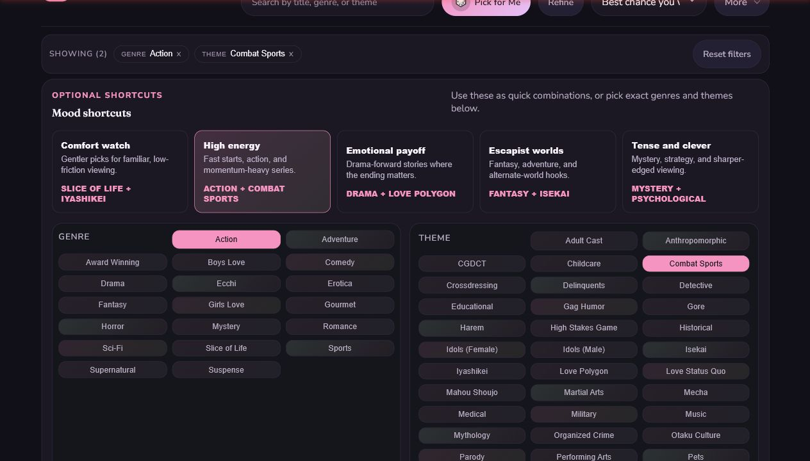
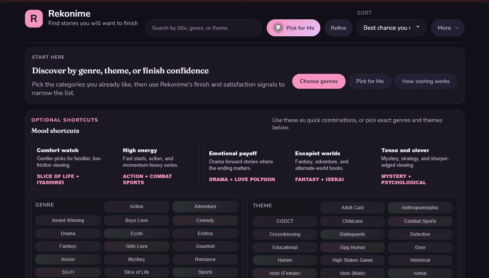
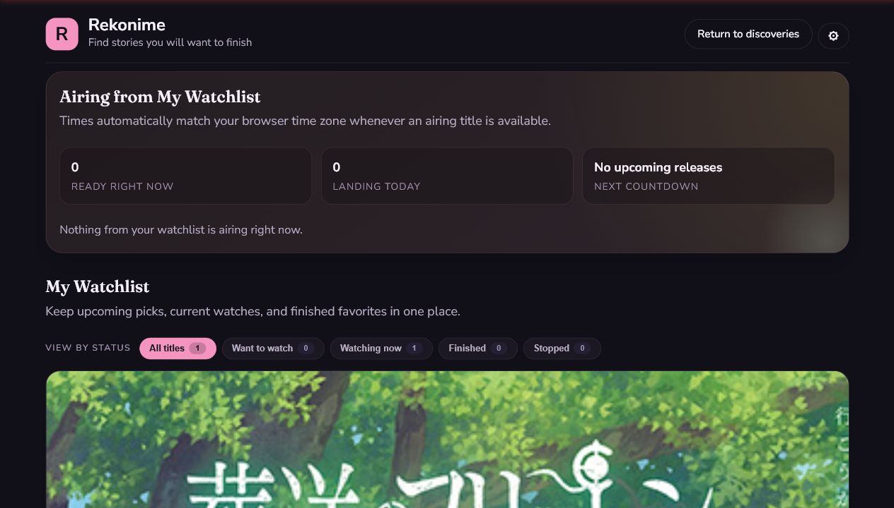
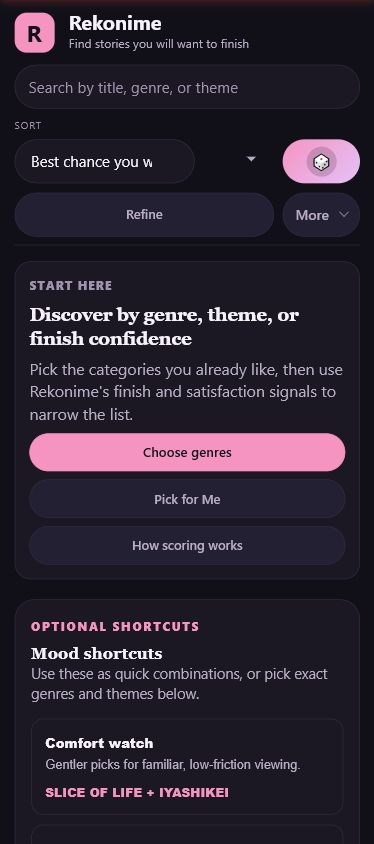
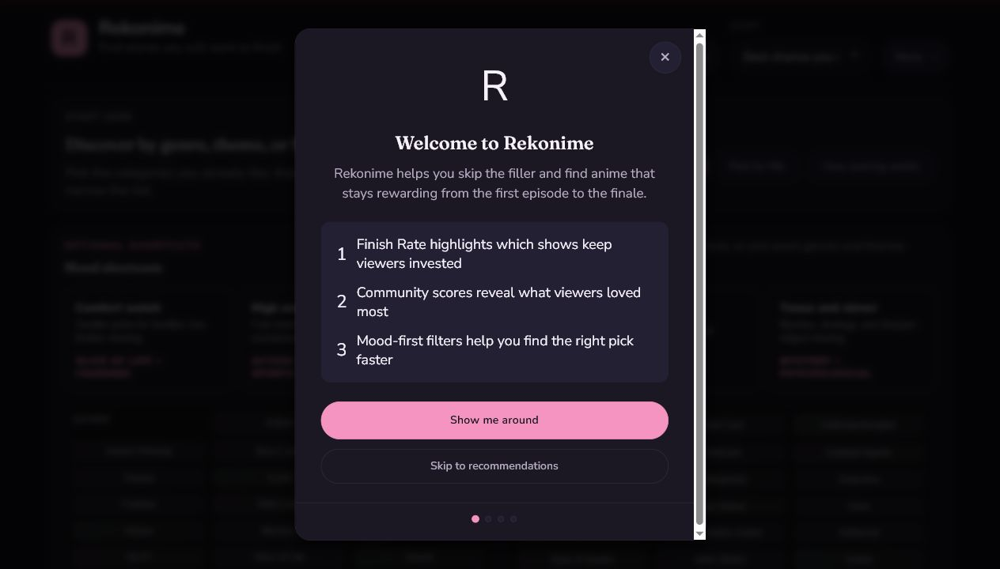
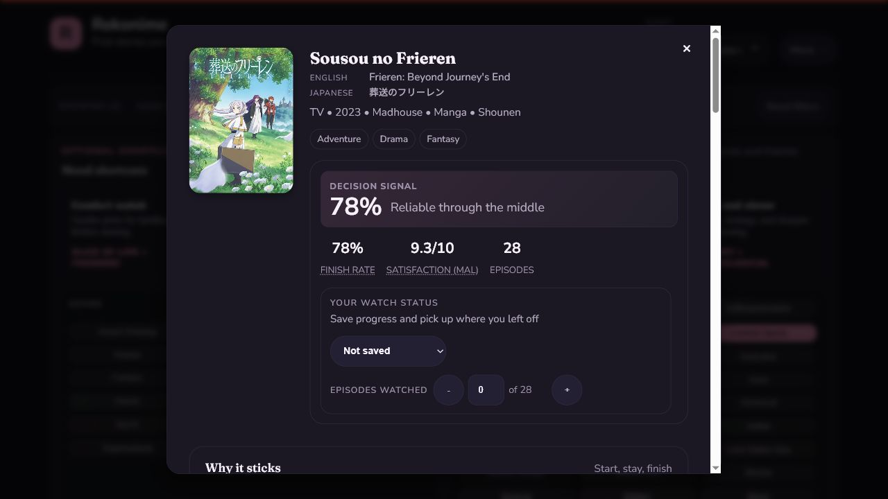

# Rekonime UX Hierarchy of Needs Audit

Date: 2026-06-15

## Audit Scope

- Product: Rekonime anime discovery and watchlist app.
- Audience: anime viewers choosing what to watch and tracking progress.
- Primary journey: discover a title, evaluate it, save it, and return to the watchlist.
- Decision supported: which UX improvements should be prioritized next.
- Framework: Stephen P. Anderson's six levels, from Functional through Meaningful.
- Evidence: current local app at desktop and mobile sizes, current source behavior, and screenshots captured during this audit.

Anderson's hierarchy is a prioritization model, not a standardized scoring instrument. The status labels below are qualitative judgments.

## Executive Finding

Rekonime is already functional, visually distinctive, and unusually rich in decision support. Its largest gap is the transition from **usable** to **convenient**: users must process too many controls and too much information before reaching the next useful decision.

The reliability layer also needs attention. Two prominent claims currently overstate what the underlying behavior proves: the "Live" trending list is partly randomized, and "Finish Rate" reads like observed completion data even though it is a modeled confidence signal.

## Hierarchy Assessment

| Level | Current status | Main evidence |
| --- | --- | --- |
| Functional | Mostly met, with broken shortcuts | Search, details, watch status, progress, and watchlist work. The tested "High energy" shortcut produced no matching recommendations. |
| Reliable | At risk | "Trending Right Now - Live" is generated from a heuristic with a random factor. The local run also fell back after a catalog load error while showing an offline warning. |
| Usable | Generally met | Labels, keyboard semantics, ARIA structure, and the detail summary are strong. Dense filters, ambiguous search scope, and mobile control compression add friction. |
| Convenient | Largest opportunity | Recommendations are below a large filter wall. The watchlist prioritizes an empty airing dashboard and oversized artwork over progress actions. |
| Pleasurable | Strong visual base | Typography, color, imagery, and first-run presentation feel intentional. Delight is mostly visual rather than tied to useful feedback or progress. |
| Meaningful | Promising, underdeveloped | Watch tracking and personalized recommendations exist, but the app does little to reflect a viewer's taste, history, goals, or accomplishments back to them. |

## Priority Recommendations

### 1. Make trust claims match the data

**Hierarchy:** Reliable  
**Priority:** P0

The interface labels a heuristic list as "Trending Right Now" and "Live", while `Discovery.calculateTrendingScore()` adds a random factor to static catalog, recency, rating, and retention data. This can damage trust once users notice results changing without a real trend source.

Choose one:

- Connect the list to a dated, named popularity source and display freshness, such as "Updated 2 hours ago".
- Rename it to an honest editorial concept such as "Popular recent picks" and remove "Live".

Rename the modeled metric consistently from **Finish Rate** to **Finish Confidence**. Keep the compact label on cards and use explanatory copy such as "an estimated confidence score" in onboarding, help, and methodology content. Add a short methodology and data freshness disclosure near the first use, with the detailed explanation available on demand.

Evidence:

- `index.html`: "Trending Right Now" and "Live".
- `js/discovery.js`: the trending score includes `Math.random() * 10`.
- The UI alternates between "Finish confidence" and "Finish Rate".

### 2. Guarantee that guided shortcuts lead somewhere useful

**Hierarchy:** Functional, Reliable  
**Priority:** P0

The "High energy" shortcut selected `Action + Combat Sports` and produced no recommendations or catalog matches. A guided entry point that immediately dead-ends is worse than an empty filter form because it breaks the product's promise to reduce effort.

Before rendering a mood shortcut:

- Calculate the candidate count for the actual filter combination.
- Select a viable combination rather than the first available genre and theme.
- If the result set is small, show the count on the shortcut.
- If no exact intersection exists, fall back to an OR strategy or a metric-based definition such as strong opening score plus momentum.

For all zero-result states, offer one-click recovery such as "Remove Combat Sports" or "Broaden to Action".

### 3. Put recommendations before the full filter taxonomy

**Hierarchy:** Convenient  
**Priority:** P1

The first screen explains the value clearly, but desktop users see a large mood, genre, and theme control surface before any actual recommendations. On mobile, the first recommendation is even farther away.

Recommendations should appear before the full filter taxonomy, not before all personalization input. Recommended home order:

1. Value statement.
2. One compact first-session intent question, such as "What do you want from your next watch?", with four validated viewing outcomes plus **Surprise me**.
3. Three to six recommendations based on that choice.
4. A compact "Tune these picks" row with mood, time commitment, and familiarity.
5. Full genre and theme controls behind "More filters".

For returning users, use Watchlist Lifecycle history and explicit feedback as the default personalization input, while keeping the compact intent question available for the current session. Treat mood selections as temporary session context; do not add them to the lasting taste profile.

Use desired viewing outcomes rather than current-mood labels or genre bundles:

- **Help me unwind:** gentle, stable, low-friction viewing.
- **Give me energy:** quick hooks, momentum, and excitement.
- **Make me feel something:** moving, emotionally rewarding stories.
- **Pull me into another world:** immersive stories across fantasy, mystery, suspense, and other genres.
- **Surprise me:** bypass intent selection.

These labels should remain genre-neutral and action-oriented. Validate each outcome against user research and catalog coverage before launch.

The current preview catalog does not discriminate some outcomes reliably: `comfortScore`, `flowState`, and `emotionalStability` are tightly clustered near the top of their ranges. Recalibrate those metrics or add stronger content signals before using them as primary intent classifiers.

Define **Help me unwind** using low stress, high emotional stability, low barrier to entry, and manageable continuity.

Allow sad or dramatic titles to qualify for **Help me unwind** when their experience remains gentle and emotionally stable. Exclude intensity and distress, not sadness itself.

Define **Give me energy** using a strong early hook, positive momentum, brisk flow, and high-arousal content signals. Do not require the Action genre; sports, comedy, music, adventure, and other genres may qualify.

Allow grim or stressful titles to qualify for **Give me energy** when their pace and arousal fit the outcome. Energy does not imply positive emotional tone. Show clear **Intense**, **Dark**, or equivalent content cues on the recommendation card before the user opens the title.

Define **Make me feel something** using emotional payoff, meaningful themes, character investment, and a strong ending. Include joy, tenderness, awe, grief, and catharsis; do not equate emotional value only with sadness or Drama tags.

Do not infer emotional payoff solely from episode-score patterns. Add curated content attributes or validated audience tags for character investment, meaningful themes, and emotional outcomes, then combine them with finale strength and satisfaction. Treat **Make me feel something** as experimental until those signals exist.

Define **Pull me into another world** using strong world-building, narrative curiosity, sustained engagement, and manageable entry friction. Fantasy, mystery, historical drama, science fiction, and grounded thrillers may qualify; do not require Isekai or any other genre.

Allow complex, slow-starting titles to qualify when their eventual immersion is strong. Label them **Slow burn**, **Needs patience**, or equivalent, and rank easier entry points first unless the user's Taste Profile indicates a preference for complexity.

Treat **Surprise me** as constrained discovery rather than unrestricted randomness. Randomize within a qualified pool that excludes invalid franchise entry points, tracked titles, explicit exclusions, and titles with insufficient confidence data. Prefer diversity from recently shown recommendations without ignoring the Taste Profile.

Use an approximately 80/20 familiarity-to-exploration balance for **Surprise me**. Explain exploratory picks explicitly, for example: "A little outside your usual genres, but it matches your preference for slow-burn stories."

After first use, offer an optional Taste Profile adventure setting: **Familiar**, **Balanced**, or **Adventurous**, with **Balanced** as the default. Do not include this choice in initial onboarding.

Apply the adventure setting to all personalized recommendations, with its strongest visible effect on **Surprise me**. Maintain minimum relevance, confidence, and quality thresholds regardless of the selected level.

Allow the current session intent to temporarily broaden or narrow recommendations when necessary to satisfy the selected viewing outcome. Explain broader picks when relevant, and never rewrite the lasting Taste Profile adventure setting from session behavior.

Expire the selected session intent at the end of the browser session or after four hours of inactivity, whichever comes first. Keep the active intent visible and easy to change while it remains active.

Preserve the active intent across page reloads and same-tab navigation using session-scoped storage with an activity timestamp. Navigation between discovery, the Detail Experience, and the Watchlist must not unexpectedly reset it.

Do not inherit active session intent into a newly opened tab. Each tab is a separate viewing context, while the lasting Taste Profile remains shared.

When a user changes a recommended title to **Watching now**, treat the discovery task as complete. Clear the active session intent, show a subtle confirmation, and allow the user to select a new intent if they continue browsing.

Do not clear the active session intent when a title is added as **Want to watch**. Saving for later is not the same as choosing what to watch now; keep the intent active so the user can continue comparing options.

Do not clear the active session intent when an existing title is changed to **Finished** or **Stopped**. Those are Watchlist Lifecycle maintenance actions rather than evidence that the current discovery task is complete.

Refresh recommendation results immediately after **Finished**, **Stopped**, or **Loved it** changes, but preserve visible card positions where possible. Announce a quiet **Recommendations updated** status and avoid replacing the entire row while the user is reading it.

If the acted-on title is visible in the recommendation row and becomes ineligible, keep its card temporarily in place with a clear state such as **Added to Watchlist** or **Marked finished**. Remove it on the next navigation or refresh rather than immediately.

Fill newly available recommendation slots immediately, but append replacements after stable cards. Do not reorder cards the user is already comparing.

Show four recommendations before the full filters on desktop and three on mobile, followed by a clear **See more matches** action. This should provide meaningful choice without recreating a large catalog above the taxonomy.

Have **See more matches** open a focused catalog view with the active session intent and Taste Profile applied. Do not expand a large recommendation set inline, because that would push advanced filters farther down and blur the distinction between recommendations and browsing.

In the focused catalog, show a persistent summary such as **Showing matches for: Help me unwind**, with **Change intent** and **Clear intent** actions. Display explicit genre and theme filters separately so users can distinguish session context from manual filtering.

Make **Clear intent** remove only the active session intent. Preserve explicit genre and theme filters, and provide a separate **Reset all** action for removing every constraint.

Treat explicit genre and theme filters as hard constraints. Use session intent to rank the matching results rather than override those filters. If the combination produces too few results, explain the conflict and offer to relax a specific filter instead of silently ignoring it.

Treat fewer than four eligible titles as too narrow, because the result cannot fill the desktop recommendation set. Warn before presenting the row and offer the single constraint relaxation that adds the most suitable results.

Never relax or suggest overriding an explicit Taste Profile exclusion in the recommendation flow. The user must deliberately edit that exclusion in the Taste Profile.

Do not introduce a separate content-boundary subsystem at this stage. Sensitive themes such as **Gore** remain available only through the full theme taxonomy and should be shown clearly on title cards and in the Detail Experience. Revisit stronger controls only if user research or broader metadata coverage demonstrates a real need.

If a new user skips the intent question, default to balanced, broadly accessible titles with strong Finish Confidence and community satisfaction. Exclude sequels unless the franchise data identifies them as a valid starting point.

Keep active filters and result count sticky after a choice. Update the first recommendation row immediately so the effect of a filter is visible without scrolling.

### 4. Make the watchlist task-first

**Hierarchy:** Convenient, Meaningful  
**Priority:** P1

With one saved title, the watchlist gives the first large content block to an empty airing dashboard. The saved title then uses a very large image, pushing status and progress controls below the fold.

Change the default hierarchy:

- Lead with "Continue watching" and put episode progress controls in the first viewport.
- Collapse the airing dashboard to a one-line status when it has no releases.
- Use compact horizontal watchlist rows or smaller covers.
- Sort "Watching now" ahead of other statuses by default.
- Add a clear next action, such as "Episode 1 next" or "Continue from episode 6".

### 5. Clarify search scope and preserve user context

**Hierarchy:** Usable, Convenient  
**Priority:** P1

Searching for "Frieren" while `Action + Combat Sports` was active returned global title matches even though the filtered catalog had no matches. Opening the result preserved the incompatible filters in the URL. The behavior is useful, but the scope is unclear.

Use explicit language:

- "Search all titles" when search ignores filters.
- "Search these results" when it respects filters.
- On opening a global result, offer "Clear current filters" or temporarily separate the detail route from the browse filter state.

Do not make users infer why search found a title that the page says does not match.

### 6. Simplify the mobile header

**Hierarchy:** Usable  
**Priority:** P1

At a 390 by 844 test size, the sort label is clipped and "Pick for Me" becomes an unexplained icon-only control. Search, sort, random pick, Refine, and More compete for the same small area.

Recommended mobile pattern:

- Keep search as the primary full-width control.
- Use two labeled actions: "Pick for me" and "Filters".
- Move sort into the filter sheet or a compact labeled menu.
- Keep the watchlist as a persistent navigation destination rather than hiding it under More.

### 7. Teach the scores in context, not before the experience

**Hierarchy:** Convenient, Pleasurable  
**Priority:** P2

The first-run modal is polished and skippable, but it asks users to learn the product's metric system before they have experienced its value.

Replace the four-step educational tour with:

- A one-screen welcome that asks for one preference or mood.
- Immediate recommendations based on that choice.
- Contextual explanations attached to the first Finish Confidence and Satisfaction values.
- A persistent "How scoring works" entry for users who want detail.

This creates an early success moment instead of front-loading explanation.

### 8. Keep the detail view decision-first

**Hierarchy:** Convenient  
**Priority:** P2

The first fold of the detail view is strong: title, image, decision signal, community rating, episode count, and watch status are easy to scan. The full modal then becomes very long, combining synopsis, franchise order, trailer, reviews, and similar titles.

Preserve the current top summary, then group secondary content into tabs or collapsible sections:

- Overview
- Watch order
- Reviews
- Similar titles

Keep watch status and episode progress sticky or easy to return to after scrolling.

### 9. Turn personalization into user-controlled learning

**Hierarchy:** Pleasurable, Meaningful  
**Priority:** P2

The app can recommend from watchlist preferences, but users need a visible feedback loop to understand and shape that personalization.

Add lightweight controls:

- "More like this"
- "Not for me"
- "Less of this genre"
- "I have already seen this"

Explain recommendations with concrete reasons such as "Because you finished Frieren and prefer low-stress fantasy". Let users edit or reset inferred preferences.

Show one concise recommendation reason directly on each card, such as "Matches your comfort mood" or "Because you finished Frieren". Keep detailed scoring and contributing signals behind an explanation control so cards remain scannable.

Show at most two relevant theme or intensity cues alongside that single recommendation reason. Do not display the title's full genre and theme taxonomy on recommendation cards.

Choose one cue that explains the selected viewing outcome and one cue that materially changes expectations, such as **Slow burn**, **Dark**, **Gentle**, or **Complex**. Avoid redundant genre labels.

Use a small curated **Experience Cue** vocabulary with documented classification rules. Do not display raw catalog tags as recommendation explanations; keep those tags available in advanced filters and the Detail Experience.

Start with eight Experience Cues: **Gentle**, **Fast hook**, **High energy**, **Emotional**, **Immersive**, **Slow burn**, **Dark**, and **Complex**. Add a new cue only when it changes a meaningful viewing decision.

A title may support more than two Experience Cues internally. Select at most two for each recommendation card based on the active session intent and the most decision-relevant expectation, while showing the full supported set in the Detail Experience.

Generate and validate Experience Cues during the catalog data-build pipeline, then store them in the Catalog Payload. Runtime code should select the contextually relevant cues, not reinterpret classification rules on every page load.

Do not require every title to have an Experience Cue. When evidence is missing or weak, store no cue rather than fabricating a classification. Such titles may remain in the catalog but should rank lower for intent-based recommendations.

Allow titles without Experience Cues in **Surprise me** only when no viewing outcome is active and the title otherwise has strong confidence data. Explain them as exploratory picks rather than implying a specific experiential fit.

Store an internal normalized confidence score and evidence sources for each Experience Cue. Display a cue only above a validated threshold; do not expose the raw cue-confidence number in the interface.

Allow a manually curated Experience Cue to add, remove, or adjust a computed cue. Record the override reason, author, and date so the decision remains auditable.

Do not expire manual overrides automatically. Flag them for review when underlying evidence changes materially or after one year, whichever comes first.

Treat the following as material changes: a changed episode set, a major metric movement across a cue threshold, changed genre or theme metadata used by the classification rule, or replacement of the cue-classification model. Routine score refreshes that do not cross a threshold should not trigger review.

When a manual override needs review, emit a warning during normal catalog builds. Fail strict validation when an override is past its review deadline or when the rule inputs supporting it no longer exist.

Use Watchlist Lifecycle states as weighted taste evidence:

- **Finished:** strong positive evidence.
- **Watching now:** weak positive evidence, strengthened as episode progress increases.
- **Want to watch:** intent evidence only; do not treat it as demonstrated taste.
- **Stopped:** negative evidence, strengthened when the user stops early and softened when they watched most of the title.

Use the Watchlist Entry timestamps and progress to distinguish recent, demonstrated preferences from older or weaker intent.

Apply recency weighting slowly rather than resetting the taste profile around the latest activity. Recent viewing should have more influence, but completed favorites should retain a durable baseline influence instead of fading like ordinary history.

Let inferred negative evidence from **Stopped** titles fade over time, because stopping may reflect timing or one title's execution rather than dislike of its genres or themes. Explicit **Less like this** feedback should persist longer and remain reversible.

When a user chooses **Less like this**, ask what should be reduced: this title, a named genre or theme, or recommendations based on this title. Default to suppressing only the title; never infer a broad genre or theme dislike from one action.

Store broader genre and theme preferences in a separate, editable **Taste Profile**. Watchlist Entries should retain title-specific status, progress, timestamps, and affinity; the Taste Profile should retain cross-title preferences and exclusions.

Make the Taste Profile inspectable and editable. Clearly label inferred genres and themes, allow individual preferences to be removed or reversed, and provide a **Reset Taste Profile** action. Do not rely on hidden personalization state.

Weight explicit Taste Profile choices more strongly than inferred Watchlist Lifecycle evidence. Use inference to fill gaps when explicit data is sparse; never let it silently override a preference the user stated.

When repeated behavior contradicts an explicit preference, do not rewrite the Taste Profile automatically. Surface a specific suggestion, such as "You've recently enjoyed several mystery titles. Update your Taste Profile?", and require confirmation.

Only show a Taste Profile update suggestion after a strong repeated pattern. Limit each preference suggestion to once every 30 days and provide a permanent **Don't suggest this again** option for that preference.

Define a strong repeated pattern as at least three positive, demonstrated signals across distinct titles within 90 days, including at least one **Finished** or **Loved it** signal. **Want to watch** entries alone must not trigger a Taste Profile update suggestion.

Collapse related seasons and entries into one franchise-level signal for Taste Profile inference. A long franchise must not count as multiple independent preference events merely because the user watched several of its entries.

When recommending a franchise, recommend its valid starting point rather than whichever installment has the highest score. If a later installment provides stronger evidence, use it only as supporting context, such as "Start here; season 2 has the stronger payoff."

Exclude titles with **Watching now**, **Finished**, or **Stopped** Watchlist Entries from discovery recommendations. Usually exclude **Want to watch** titles as well, but surface them separately as **Already on your list** when a reminder is useful.

Show **Already on your list** only when a planned title strongly matches the current session mood or becomes timely, such as when it is currently airing. Do not make it a permanent recommendation row.

After 180 days without interaction, suppress reminders for a **Want to watch** entry unless it becomes newly relevant, such as through a strong current-session match or a new airing event. Keep the Watchlist Entry intact.

Occasionally offer a private **Still interested?** review for stale **Want to watch** entries, with **Keep**, **Start watching**, and **Remove** actions. Never remove or change an entry automatically.

Show at most five stale entries per cleanup session, prioritized by oldest interaction. Allow the user to dismiss the review and resume with the remaining entries later.

Treat **Keep** as renewed intent: update the Watchlist Entry timestamp and suppress another stale-entry review for 180 days.

Renewed **Want to watch** intent may strengthen recommendation evidence only slightly. It remains intent rather than demonstrated enjoyment, even after the user confirms **Keep**.

After a title is completed, offer an explicit private **Loved it** action. Store this affinity on the Watchlist Entry alongside status, progress, and lifecycle timestamps. Make it a reversible toggle and update the Watchlist Entry timestamp when it changes, without removing or rewriting viewing history. Treat it as durable positive evidence. Do not infer that a title is a favorite merely because the user completed it or because it has a high community score.

Removing a title should delete its entire Watchlist Entry, including its **Loved it** value and all recommendation influence. Do not preserve hidden title-level preference data after removal.

### 10. Reflect the viewer's journey back to them

**Hierarchy:** Meaningful  
**Priority:** P3

Meaning will come from helping viewers understand and remember their own relationship with anime, not from adding generic badges.

Useful directions:

- A private taste profile that evolves from explicit feedback and completed titles.
- Personal summaries such as favorite themes, completion patterns, or "shows you were glad you finished".
- A seasonal or annual viewing recap.
- Optional viewing intentions, such as a short comfort watch or one longer series this month.
- Watchlist export and import so personal history is not trapped in one browser.

Avoid competitive points unless user research shows they support the viewing goal.

## Strengths to Preserve

- The visual system has a coherent identity and good contrast in the sampled dark theme.
- The tagline and first-screen copy communicate a differentiated promise.
- Search supports multiple title forms and exposes useful metadata.
- The detail summary supports a real decision rather than only showing catalog facts.
- Watch status and episode progress work without an account.
- The sampled DOM had strong semantic labels, dialogs, headings, controls, and live regions.
- The app supports reduced motion, themes, keyboard shortcuts, offline fallback, and no-JavaScript messaging in source.

## Captured Flow

| Step | Description | General health |
| --- | --- | --- |
| 1 | First-run onboarding | Healthy presentation; education is front-loaded. |
| 2 | Home discovery screen | Visually strong; recommendations are hidden below dense controls. |
| 3 | Apply "High energy" mood shortcut | Unhealthy; shortcut produced a zero-result combination. |
| 4 | Search for and open Frieren | Healthy detail summary; search scope conflicts with active filters. |
| 5 | Set status to "Watching now" and open watchlist | Function works; watchlist hierarchy delays the progress task. |
| 6 | Review mobile home | Responsive without horizontal overflow; header controls are compressed and partly unclear. |

## Checks

- Six screenshots captured and visually inspected.
- Desktop journey tested at the browser's default 1280 by 720 viewport.
- Mobile home tested with a 390 by 844 viewport override.
- Search, mood filtering, detail opening, status saving, and watchlist persistence exercised.
- Browser semantics inspected from the rendered DOM.
- Console warnings and catalog endpoints checked.
- Source behavior checked for mood shortcut construction and trending calculation.

## Risks and Limits

- This was an expert audit, not moderated usability research.
- No production deployment was tested, so the observed catalog load fallback and offline warning need production verification.
- No full WCAG audit, screen-reader session, color contrast calculation, zoom test, or Office-style accessibility checker was performed.
- Community reviews, external images, airing data, and external network behavior may vary.
- Meaningful UX recommendations should be validated with actual viewers before becoming a broad engagement system.

## Sources

- Stephen P. Anderson, [UX Hierarchy Model](https://poetpainter.com/thoughts/files/UX-Hierarchy-Model-StephenPAnderson.pdf).
- Paul Boag interview, [Stephen Anderson on Emotional Design](https://boagworld.com/design/emotional-design/).

## Recommended Delivery Sequence

1. Fix trust claims and zero-result shortcuts.
2. Reorder home and watchlist around immediate user decisions.
3. Simplify mobile controls and clarify search scope.
4. Restructure onboarding and detail content.
5. Validate meaningful personalization concepts with users.
