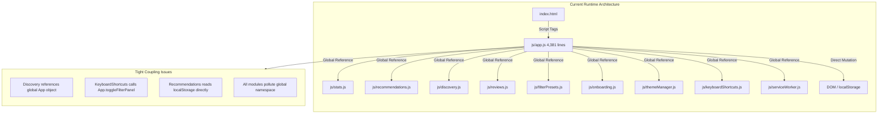
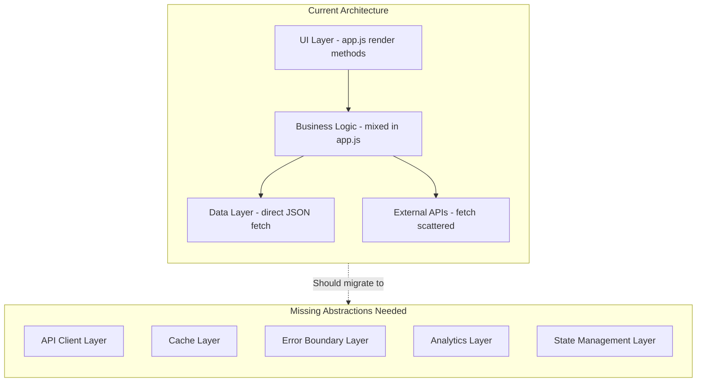
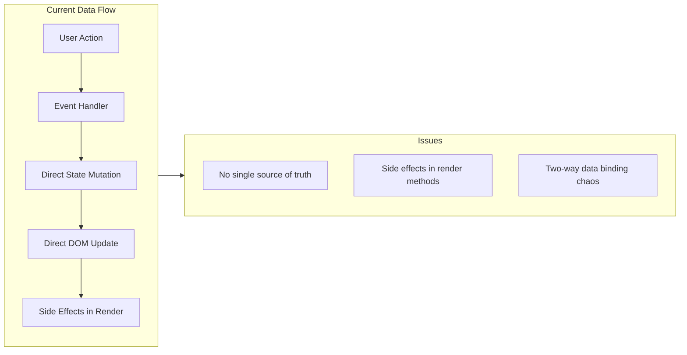
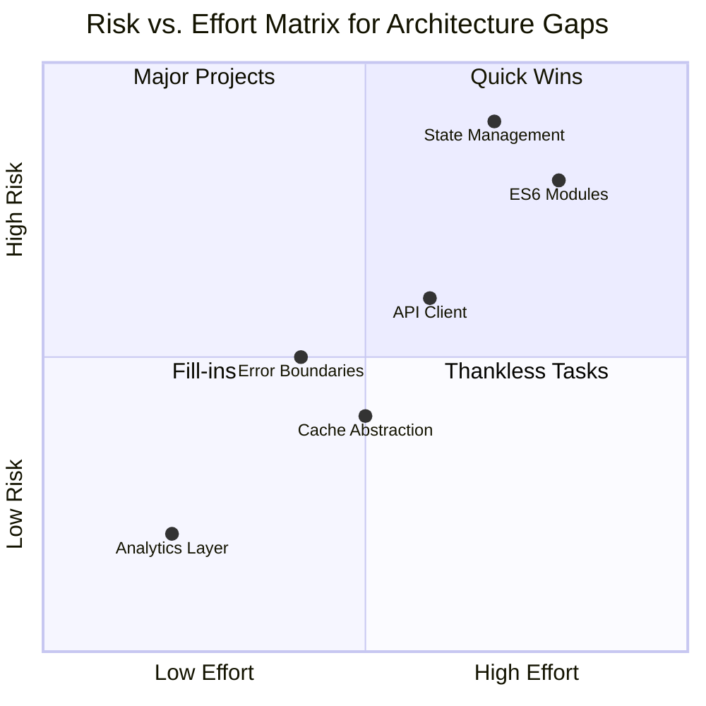
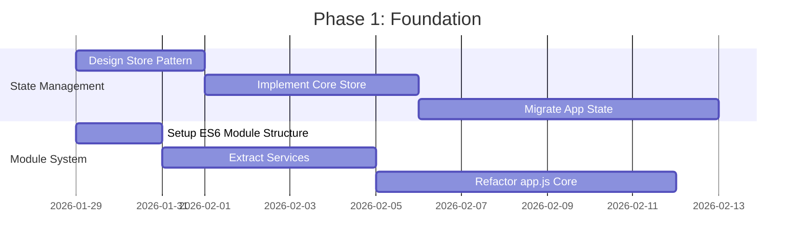
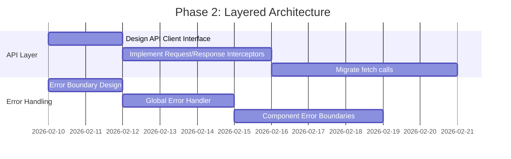
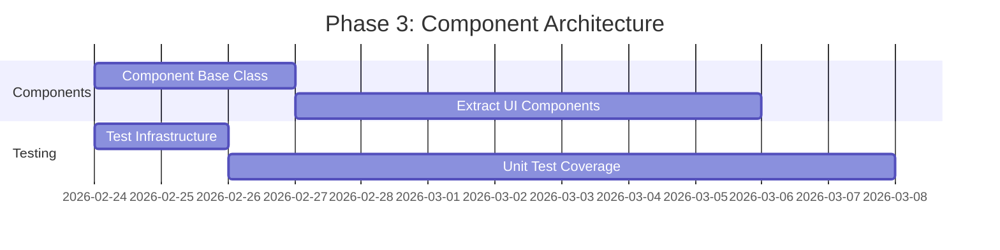
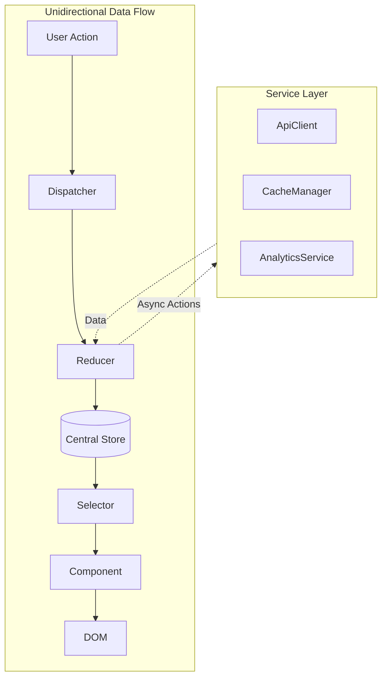
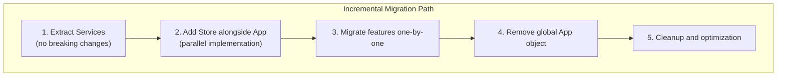

# Architecture Gap Analysis - Rekonime

## Executive Summary

This document provides a comprehensive gap analysis of the Rekonime codebase architecture. The current implementation exhibits characteristics of a monolithic architecture with tight coupling, scattered concerns, and missing abstractions that will impede scalability and maintainability as the application grows.

---

## 1. Current Architecture Overview

### 1.1 Module Dependencies



### 1.2 Current File Size Distribution

| File | Lines | Responsibility |
|------|-------|----------------|
| `js/app.js` | 4,381 | UI Rendering, State Management, Event Handling, SEO, URL Management, Bookmarks, Settings, Modals, Search |
| `js/stats.js` | 1,110 | Statistical Calculations |
| `js/recommendations.js` | 714 | Recommendation Logic |
| `js/reviews.js` | 795 | API Integration (Jikan), Review Processing |
| `js/discovery.js` | 407 | Discovery Features |
| `js/keyboardShortcuts.js` | 460 | Keyboard Navigation |
| **Total JS** | **~7,867** | |

---

## 2. Critical Architecture Gaps

### 2.1 Monolithic Module Structure

#### Current State
- **js/app.js** is 4,381 lines handling:
  - State management (animeData, filteredData, activeFilters, bookmarks)
  - DOM rendering (12+ render methods)
  - Event handling (20+ event handlers)
  - URL/SEO management
  - Search functionality
  - Modal management
  - Settings/bookmarks persistence

#### Gap Analysis

| Aspect | Current State | Gap | Risk Level |
|--------|---------------|-----|------------|
| **Module Dependencies** | js/app.js directly references all modules via global scope | No clear separation of concerns; modules directly reference global App object | 🔴 High |
| **State Management** | Centralized in App object with direct DOM mutations | No unidirectional data flow; state changes scattered across event handlers | 🟡 Medium |
| **Module Loading** | Script tags with defer in index.html | No module bundler; relies on global scope pollution | 🟡 Medium |
| **Code Organization** | Single file handles 15+ distinct responsibilities | Violates Single Responsibility Principle | 🔴 High |

#### Specific Tight Coupling Examples

```javascript
// Discovery.js line 50-51: Direct global App reference
if (useBookmarks && typeof App !== 'undefined' && App.bookmarkIds?.length > 0) {
    candidates = this.weightByBookmarkPreferences(candidates);
}

// KeyboardShortcuts.js line 396-399: Direct App method calls
openFilters() {
    if (typeof App !== 'undefined' && App.toggleFilterPanel) {
        App.toggleFilterPanel();
    }
}

// Recommendations.js line 459-463: Direct localStorage access
setMode(modeKey) {
    if (this.modes[modeKey]) {
        this.currentMode = modeKey;
        try {
            localStorage.setItem('rekonime.recMode', modeKey);
        } catch (e) {}
    }
}
```

---

### 2.2 Missing Layered Architecture

#### Current vs. Target Architecture



#### Gap Detail: Missing Layers

| Layer | Current Implementation | Gap Impact | Risk |
|-------|------------------------|------------|------|
| **API Client Layer** | Direct `fetch()` calls in app.js and reviews.js | No request/response interceptors, no centralized error handling, no request deduplication | 🔴 High |
| **Cache Layer** | Ad-hoc localStorage usage across 5+ files | Inconsistent caching strategies, no cache invalidation, duplicate storage logic | 🟡 Medium |
| **Error Boundary Layer** | Try-catch blocks scattered inconsistently | No unified error handling, no error recovery patterns | 🟡 Medium |
| **Analytics Layer** | Direct `gtag()` calls in app.js | No abstraction for analytics provider, hard to switch or mock | 🟢 Low |
| **State Management Layer** | Direct state mutation in App object | No predictable state updates, race conditions possible | 🔴 High |

---

### 2.3 State Management Anti-Patterns

#### Current State Model

```javascript
// From app.js lines 5-71: Monolithic state object
const App = {
    animeData: [],              // Raw catalog data
    filteredData: [],           // Filtered view
    currentSort: 'retention',
    filterPanelOpen: false,
    currentAnimeId: null,
    isFullDataLoaded: false,
    loadingFullCatalog: false,
    bookmarkIds: [],
    bookmarkIdSet: new Set(),
    settings: null,
    activeFilters: { /* 7 filter types */ },
    filterOptions: { /* 7 option arrays */ },
    // ... 20+ more state properties
};
```

#### State Management Issues

| Issue | Example | Impact |
|-------|---------|--------|
| **Direct State Mutation** | `this.activeFilters[type].push(valueStr)` | No change tracking, hard to debug |
| **Derived State Not Cached** | Filter calculations run on every render | Performance degradation |
| **No State Persistence Strategy** | Settings/bookmarks use different keys | Inconsistent user experience |
| **Race Conditions Possible** | `loadFullCatalog()` can be called multiple times | Duplicate data loading |

---

### 2.4 Data Flow Issues



---

## 3. Detailed Gap Assessment

### 3.1 Gap Matrix

| Category | Gap | Current Severity | Target State | Priority |
|----------|-----|------------------|--------------|----------|
| **Modularity** | Monolithic app.js | 🔴 Critical | ES6 modules with clear exports | P0 |
| **State Management** | No centralized store | 🔴 Critical | Redux-style or Store pattern | P0 |
| **API Layer** | Scattered fetch calls | 🟡 High | Centralized API client with interceptors | P1 |
| **Error Handling** | Inconsistent try-catch | 🟡 High | Error boundary layer with recovery | P1 |
| **Caching** | Ad-hoc localStorage | 🟡 Medium | Cache abstraction with TTL support | P2 |
| **Analytics** | Direct gtag calls | 🟢 Low | Analytics abstraction layer | P3 |
| **Testing** | Limited test coverage | 🟡 Medium | Unit tests for all modules | P2 |

### 3.2 Risk Assessment



---

## 4. Refactoring Roadmap

### Phase 1: Foundation (P0 - Critical)
**Goal:** Establish module boundaries and state management



#### Deliverables:
1. **Store Module** - Centralized state with subscribe/notify pattern
2. **ES6 Module Structure** - Clear imports/exports, no global pollution
3. **Service Extraction** - API, Cache, Analytics as injectable services

---

### Phase 2: Layered Architecture (P1 - High)
**Goal:** Implement missing architectural layers



#### Deliverables:
1. **ApiClient** - Centralized HTTP with retry, caching, auth
2. **CacheManager** - Tiered caching (memory, localStorage, session)
3. **ErrorBoundary** - Unified error handling with recovery
4. **AnalyticsService** - Provider-agnostic analytics

---

### Phase 3: Component Architecture (P2 - Medium)
**Goal:** Establish component patterns and testing



#### Deliverables:
1. **Component Base** - Lifecycle management, re-rendering optimization
2. **UI Components** - Modal, Card, Filter as reusable components
3. **Test Suite** - 80%+ unit test coverage

---

## 5. Target Architecture Specification

### 5.1 Proposed Module Structure

```
js/
├── core/
│   ├── store.js              # Central state management
│   ├── event-bus.js          # Inter-module communication
│   └── dependency-container.js # DI container
├── services/
│   ├── api-client.js         # HTTP abstraction
│   ├── cache-manager.js      # Caching layer
│   ├── analytics-service.js  # Analytics abstraction
│   └── error-handler.js      # Error boundary
├── domain/
│   ├── anime/
│   │   ├── model.js          # Anime data model
│   │   ├── repository.js     # Data access
│   │   └── mapper.js         # Data transformation
│   ├── filters/
│   │   ├── model.js          # Filter state
│   │   ├── engine.js         # Filter logic
│   │   └── presets.js        # Filter presets
│   └── bookmarks/
│       ├── model.js          # Bookmark state
│       └── repository.js     # Persistence
├── features/
│   ├── catalog/
│   │   ├── index.js          # Feature entry
│   │   ├── controller.js     # Business logic
│   │   └── view.js           # Rendering
│   ├── detail-modal/
│   │   ├── index.js
│   │   ├── controller.js
│   │   └── view.js
│   ├── search/
│   │   ├── index.js
│   │   ├── controller.js
│   │   └── view.js
│   └── recommendations/
│       ├── index.js
│       ├── engine.js         # Moved from recommendations.js
│       └── view.js
├── components/
│   ├── base-component.js     # Base class
│   ├── anime-card.js
│   ├── filter-pill.js
│   ├── modal.js
│   └── skeleton.js
├── utils/
│   ├── dom.js
│   ├── sanitize.js
│   ├── url.js
│   └── search.js
├── config/
│   └── app-config.js
└── app.js                    # ~200 lines: bootstrap only
```

### 5.2 Data Flow (Target)



### 5.3 Store Interface Design

```javascript
// Target Store API
const store = createStore({
    initialState: {
        catalog: { items: [], filtered: [], loading: false },
        filters: { active: {}, options: {} },
        bookmarks: { ids: [], items: [] },
        ui: { currentModal: null, selectedAnimeId: null }
    },
    reducers: {
        catalog: catalogReducer,
        filters: filtersReducer,
        bookmarks: bookmarksReducer,
        ui: uiReducer
    },
    middleware: [loggingMiddleware, analyticsMiddleware]
});

// Usage
store.dispatch({ type: 'filters/toggle', payload: { type: 'genre', value: 'Action' } });
store.select(state => state.catalog.filtered); // Derived data with memoization
store.subscribe((state, prevState) => reRender(state));
```

---

## 6. Migration Strategy

### 6.1 Incremental Migration Approach



### 6.2 Compatibility Layer

During migration, maintain a compatibility layer:

```javascript
// js/compat/app-compat.js
// Provides global App object interface while migrating internals

export const AppCompat = {
    // Delegate to new store
    get animeData() { return store.select(s => s.catalog.items); },
    get filteredData() { return store.select(s => s.catalog.filtered); },
    
    // Delegate to new services
    toggleBookmark(id) { 
        return bookmarkService.toggle(id); 
    },
    
    // Legacy method wrappers
    init() { 
        return bootstrapApp(); 
    }
};

// Maintain global for gradual migration
window.App = AppCompat;
```

---

## 7. Success Metrics

| Metric | Current | Target | Measurement |
|--------|---------|--------|-------------|
| **app.js Lines of Code** | 4,381 | < 500 | Static analysis |
| **Module Dependencies** | 10+ globals | 0 globals | Code review |
| **Test Coverage** | ~15% | > 80% | Test runner |
| **Cyclomatic Complexity** | High | Low | ESLint |
| **Bundle Size** | ~150KB | < 100KB | Build output |
| **Time to First Render** | ~2s | < 1s | Lighthouse |

---

## 8. Recommendations

### Immediate Actions (This Sprint)
1. ✅ **Document current architecture** (this document)
2. 📋 **Setup module bundler** (Vite or Rollup)
3. 📋 **Create service abstractions** (API, Cache, Analytics)

### Short-term (Next 2 Sprints)
4. 📋 **Implement Store pattern** alongside existing App
5. 📋 **Extract domain models** (Anime, Filter, Bookmark)
6. 📋 **Add comprehensive error handling**

### Long-term (Next Quarter)
7. 📋 **Migrate to component-based UI**
8. 📋 **Achieve 80%+ test coverage**
9. 📋 **Performance optimization**

---

## 9. Appendix: Code Smells Catalog

### A. Global Namespace Pollution
**Files:** All js/*.js files
**Issue:** Each module creates global constants
```javascript
const Stats = { ... };        // Global
const Recommendations = { ... }; // Global
const App = { ... };          // Global
```

### B. Law of Demeter Violations
**File:** js/discovery.js:50-51
**Issue:** Reaching deep into App object
```javascript
if (useBookmarks && typeof App !== 'undefined' && App.bookmarkIds?.length > 0)
```

### C. Feature Envy
**File:** js/app.js:1624-1793
**Issue:** Event handlers know too much about filter internals

### D. God Object
**File:** js/app.js
**Issue:** App object has 40+ methods and 20+ state properties

---

## Document Control

| Version | Date | Author | Changes |
|---------|------|--------|---------|
| 1.0 | 2026-01-29 | Architect | Initial gap analysis |

---

*This document is a living specification. As refactoring progresses, update the gap assessment and mark completed items.*
