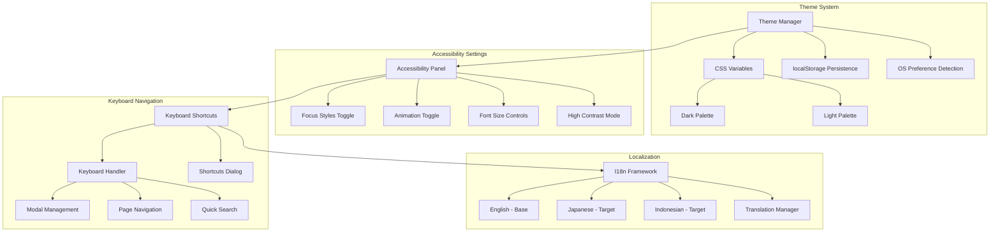

# Category E: Accessibility & Inclusion - Implementation Plan

## Gap Analysis Summary

| Gap ID | Description | Severity | Current Status |
|--------|-------------|----------|----------------|
| E1 | No Light Mode - Dark-only theme | 🟡 Medium | CSS only defines dark palette in `:root` |
| E2 | Focus States Missing on Some Elements | 🟡 Medium | CSS reset removes focus, partial re-add at lines 3942-3958 |
| E3 | No Reduced Data Mode Beyond Trailer Toggle | 🟢 Low | Settings has `dataSaver`, could be expanded |
| E4 | No Language Localization | 🟢 Low | All content is English, no i18n framework |
| E5 | No Keyboard Shortcuts Documented | 🟡 Medium | Escape works for modals, not discoverable |

---

## System Architecture



---

## E1: Light Mode Implementation

### Current State
- Single dark theme defined in `:root` (lines 1799-1877 of [`css/styles.css`](css/styles.css:1799))
- No CSS custom property switching mechanism
- Colors hardcoded throughout CSS

### Implementation Plan

#### Phase 1: CSS Architecture Refactor
1. **Create Theme Variable Files**
   - `css/themes/dark.css` - Extract existing dark theme
   - `css/themes/light.css` - Create new light theme
   - `css/themes/index.css` - Theme switching logic

2. **Variable Naming Convention**
   ```css
   /* Semantic tokens - same across themes */
   --color-bg-primary: #1A1418; /* dark */ / #FDF8F5; /* light */
   --color-bg-secondary: #241D22; /* dark */ / #FFFFFF; /* light */
   --color-text-primary: #F5E6E8; /* dark */ / #1A1418; /* light */
   --color-text-secondary: #C9B5B8; /* dark */ / #4A3F42; /* light */
   --color-accent-primary: #FFB7C5; /* consistent across themes */
   ```

3. **Theme Application Strategy**
   ```css
   /* data-attribute based switching */
   :root[data-theme="dark"] { /* dark vars */ }
   :root[data-theme="light"] { /* light vars */ }
   :root[data-theme="auto"] { 
     /* respects prefers-color-scheme */
   }
   ```

#### Phase 2: Theme Manager JavaScript
```javascript
// js/themeManager.js
const ThemeManager = {
  STORAGE_KEY: 'rekonime.theme',
  themes: ['dark', 'light', 'auto'],
  
  init() {
    const saved = this.loadTheme();
    const preferred = saved || this.detectOSPreference();
    this.applyTheme(preferred);
  },
  
  detectOSPreference() {
    return window.matchMedia('(prefers-color-scheme: light)').matches 
      ? 'light' 
      : 'dark';
  },
  
  applyTheme(theme) {
    document.documentElement.setAttribute('data-theme', theme);
    this.saveTheme(theme);
  }
};
```

#### Phase 3: UI Controls
- Add theme selector to settings panel
- Three options: Dark, Light, Auto (system preference)
- Visual theme preview icons

### Color Mapping: Dark → Light

| Token | Dark Value | Light Value | Usage |
|-------|------------|-------------|-------|
| `--bg-primary` | `#1A1418` | `#FDF8F5` | Page background |
| `--bg-secondary` | `#241D22` | `#FFFFFF` | Cards, modals |
| `--bg-tertiary` | `#2E252B` | `#F5EDEA` | Elevated surfaces |
| `--text-primary` | `#F5E6E8` | `#1A1418` | Headings, primary text |
| `--text-secondary` | `#C9B5B8` | `#5A4F52` | Secondary text |
| `--text-muted` | `#8B7B7E` | `#8B7B7E` | Muted text (same) |
| `--border-color` | `#3D2E35` | `#E8D5D0` | Borders, dividers |
| `--shadow` | `rgba(0,0,0,0.4)` | `rgba(0,0,0,0.1)` | Shadows |

---

## E2: Focus States Enhancement

### Current State
- Line 3942: `:focus-visible { outline: none; }` - Removes all focus
- Lines 3946-3958: Partial re-add for specific elements
- Missing focus states on: cards, recommendation items, filter pills

### Implementation Plan

#### Phase 1: Universal Focus Styles
```css
/* Replace the "outline: none" reset */
:focus-visible {
  outline: 2px solid var(--focus-ring-strong);
  outline-offset: 3px;
  box-shadow: 0 0 0 4px var(--focus-ring-soft);
}

/* High contrast focus for accessibility */
:root[data-high-contrast="true"] :focus-visible {
  outline: 3px solid currentColor;
  outline-offset: 4px;
}
```

#### Phase 2: Component-Specific Focus
```css
/* Anime cards - visible focus ring */
.anime-card:focus-within,
.anime-card:focus-visible {
  outline: 2px solid var(--accent-primary);
  outline-offset: 4px;
  transform: translateY(-4px);
  box-shadow: 
    0 12px 24px rgba(0, 0, 0, 0.15),
    0 0 0 2px var(--accent-primary);
}

/* Quick filter chips */
.quick-chip:focus-visible {
  outline: 2px solid var(--accent-primary);
  outline-offset: 2px;
}

/* Modal close buttons */
.modal-close:focus-visible {
  outline: 2px solid var(--error);
  outline-offset: 3px;
}
```

#### Phase 3: Focus Visible Polyfill
```javascript
// Ensure :focus-visible works in older browsers
if (!CSS.supports('selector(:focus-visible)')) {
  document.body.classList.add('js-focus-visible');
}
```

---

## E3: Expanded Reduced Data Mode

### Current State
- [`js/app.js`](js/app.js:409-414) `getDefaultSettings()` includes `dataSaver: false`
- Only disables trailer embeds
- Toggle exists in settings panel

### Implementation Plan

#### Phase 1: Enhanced Data Saver Settings
```javascript
// Expanded settings structure
getDefaultSettings() {
  return {
    trailerAutoplay: !this.isMobileViewport(),
    dataSaver: false,
    // NEW: Accessibility settings
    reducedMotion: false,
    reducedDataImages: false,  // Lazy load all images
    disableAmbientEffects: false,  // Disable particle animations
    highContrast: false,
    largeText: false
  };
}
```

#### Phase 2: Data Saver Implementations

| Feature | Normal Mode | Data Saver Mode |
|---------|-------------|-----------------|
| Trailers | Embedded YouTube | External link only |
| Cover Images | High-res | Compressed/low-res |
| Ambient Particles | Animated | Disabled |
| Skeleton Shimmer | Animated | Static |
| Autoplay | Enabled | Disabled |
| Preload Data | Full catalog | Preview only |

#### Phase 3: CSS for Reduced Motion
```css
@media (prefers-reduced-motion: reduce),
       :root[data-reduced-motion="true"] {
  *, *::before, *::after {
    animation-duration: 0.01ms !important;
    transition-duration: 0.01ms !important;
  }
  
  .app-container::before {
    display: none; /* Disable particle effect */
  }
}
```

---

## E4: Localization Framework

### Current State
- All text hardcoded in English
- No i18n structure or translation files
- Language attribute in HTML is `lang="en"`

### Implementation Plan

#### Phase 1: I18n Architecture
```javascript
// js/i18n.js
const I18n = {
  currentLocale: 'en',
  translations: {},
  
  async loadTranslations(locale) {
    const response = await fetch(`locales/${locale}.json`);
    this.translations[locale] = await response.json();
    this.currentLocale = locale;
    document.documentElement.lang = locale;
  },
  
  t(key, params = {}) {
    const translation = this.translations[this.currentLocale]?.[key] || key;
    return this.interpolate(translation, params);
  }
};
```

#### Phase 2: Translation File Structure
```json
// locales/en.json
{
  "site.title": "Rekonime - Find Anime You'll Actually Finish",
  "site.tagline": "Anime worth your time",
  "search.placeholder": "Search anime...",
  "filter.genres": "Genres",
  "filter.themes": "Themes",
  "stats.retention": "Retention Score",
  "stats.satisfaction": "Satisfaction Score",
  "modal.close": "Close",
  "bookmark.add": "Add bookmark",
  "bookmark.remove": "Remove bookmark"
}
```

#### Phase 3: Markup Updates
```html
<!-- Before -->
<button id="filter-toggle">Filters</button>

<!-- After -->
<button id="filter-toggle" data-i18n="filters.button">Filters</button>
```

#### Phase 4: Target Languages
| Priority | Language | Locale | Use Case |
|----------|----------|--------|----------|
| P0 | English | `en` | Base language |
| P1 | Japanese | `ja` | Primary anime audience |
| P2 | Indonesian | `id` | User's locale (Asia/Jakarta) |

---

## E5: Keyboard Shortcuts System

### Current State
- Escape key closes modals (implemented in [`js/app.js`](js/app.js:684-705))
- Search has keyboard navigation (arrow keys, enter)
- No documentation or discoverability

### Implementation Plan

#### Phase 1: Keyboard Handler
```javascript
// js/keyboardShortcuts.js
const KeyboardShortcuts = {
  shortcuts: {
    '?': { action: 'showHelp', description: 'Show keyboard shortcuts' },
    '/': { action: 'focusSearch', description: 'Focus search box' },
    'Escape': { action: 'closeModal', description: 'Close modal/dialog' },
    'b': { action: 'goToBookmarks', description: 'Go to bookmarks page' },
    'f': { action: 'openFilters', description: 'Open filter panel' },
    's': { action: 'toggleSettings', description: 'Open settings' },
    'r': { action: 'surpriseMe', description: 'Surprise me (random anime)' },
    'ArrowLeft': { action: 'previousAnime', description: 'Previous anime (in modal)' },
    'ArrowRight': { action: 'nextAnime', description: 'Next anime (in modal)' }
  },
  
  init() {
    document.addEventListener('keydown', (e) => this.handleKeydown(e));
  },
  
  handleKeydown(event) {
    // Ignore if user is typing in input
    if (event.target.matches('input, textarea, select')) {
      if (event.key !== 'Escape') return;
    }
    
    const shortcut = this.shortcuts[event.key];
    if (shortcut && !event.ctrlKey && !event.metaKey && !event.altKey) {
      event.preventDefault();
      this.executeAction(shortcut.action);
    }
  }
};
```

#### Phase 2: Shortcuts Dialog
```html
<!-- Keyboard shortcuts modal -->
<div class="shortcuts-modal" id="shortcuts-modal">
  <h2>Keyboard Shortcuts</h2>
  <div class="shortcuts-grid">
    <div class="shortcut-item">
      <kbd>?</kbd>
      <span>Show this help</span>
    </div>
    <div class="shortcut-item">
      <kbd>/</kbd>
      <span>Focus search</span>
    </div>
    <!-- More shortcuts... -->
  </div>
</div>
```

#### Phase 3: Visual Indicator
- Show "Press ? for keyboard shortcuts" tooltip on first visit
- Store dismissal in localStorage

---

## Implementation Priority Matrix

| Gap | Quick Win | High Impact | Effort | Priority |
|-----|-----------|-------------|--------|----------|
| E2 - Focus States | ✅ | ✅ | Low | P0 |
| E5 - Keyboard Shortcuts | ✅ | ✅ | Low | P0 |
| E3 - Reduced Data | ✅ | 🟡 | Low | P1 |
| E1 - Light Mode | 🟡 | ✅ | High | P2 |
| E4 - Localization | ❌ | 🟡 | High | P3 |

---

## File Structure

```
rekonime/
├── css/
│   ├── styles.css              # Main styles
│   ├── themes/
│   │   ├── index.css           # Theme switcher
│   │   ├── dark.css            # Dark theme vars
│   │   └── light.css           # Light theme vars
│   └── accessibility.css       # Focus states, a11y utilities
├── js/
│   ├── app.js                  # Main app
│   ├── themeManager.js         # Theme switching
│   ├── keyboardShortcuts.js    # Keyboard navigation
│   └── i18n.js                 # Localization
├── locales/
│   ├── en.json                 # English (base)
│   ├── ja.json                 # Japanese
│   └── id.json                 # Indonesian
└── plans/
    └── category-e-accessibility-inclusion.md  # This document
```

---

## Success Metrics

| Metric | Target | Measurement |
|--------|--------|-------------|
| Keyboard Navigation | 100% core features | Tab-through testing |
| Focus Visibility | WCAG 2.1 AA | Visual inspection |
| Theme Preference | Persisted | localStorage check |
| Shortcut Discovery | 50% of users | Analytics on ? key |
| Screen Reader | Functional | NVDA/VoiceOver test |

---

## Design Thinking Insight

> Basic accessibility exists but could be expanded for broader audience reach.

The current implementation has a solid foundation with:
- Semantic HTML structure
- ARIA attributes on modals
- Reduced motion media query support
- Basic keyboard escape handling

The gaps represent opportunities to elevate from "compliance" to "excellence" - making the experience not just accessible, but delightful for users with different needs and preferences.
