# Category F: Technical & Performance - Implementation Plan

## Overview

This plan addresses the technical and performance gaps identified in the gap analysis. The focus is on improving loading performance, adding offline capability, optimizing image delivery, and handling API failures gracefully.

## Mermaid Flowchart

```mermaid
flowchart TD
    subgraph "F1: Service Worker"
        SW1[sw.js - Cache Strategy] --> SW2[Install Event]
        SW2 --> SW3[Cache Static Assets]
        SW1 --> SW4[Fetch Event]
        SW4 --> SW5[Cache-First for JSON]
        SW4 --> SW6[Stale-While-Revalidate]
    end

    subgraph "F2: Image Optimization"
        IMG1[Image CDN/Generation] --> IMG2[Multiple Sizes]
        IMG2 --> IMG3[120w, 240w, 480w]
        IMG3 --> IMG4[srcset Implementation]
        IMG4 --> IMG5[Lazy Loading + Native]
    end

    subgraph "F3: Deep Link Optimization"
        DL1[URL Has Anime ID] --> DL2{Anime in Preview?}
        DL2 -->|Yes| DL3[Open Modal Immediately]
        DL2 -->|No| DL4[Show Loading Skeleton]
        DL4 --> DL5[Fetch Single Anime]
        DL5 --> DL6[Open Modal]
        DL3 --> DL7[Lazy Load Full Catalog]
        DL6 --> DL7
    end

    subgraph "F4: Modal Skeleton Screens"
        SK1[Modal Opens] --> SK2[Header Skeleton]
        SK1 --> SK3[Stats Skeleton]
        SK1 --> SK4[Synopsis Skeleton]
        SK1 --> SK5[Trailer Placeholder]
        SK1 --> SK6[Reviews Skeleton]
        SK1 --> SK7[Similar Anime Skeleton]
    end

    subgraph "F5: Retry Mechanism"
        API1[Jikan API Call] --> API2{Success?}
        API2 -->|Yes| API3[Render Reviews]
        API2 -->|No| API4[Show Error + Retry Button]
        API4 --> API5[User Clicks Retry]
        API5 --> API6[Exponential Backoff]
        API6 --> API1
    end
```



---

## Gap F1: Service Worker - No Offline Capability

**Severity:** Medium
**Evidence:** Static HTML/JS, no PWA features

### Problem
The application has no service worker, meaning:
- Users cannot access the app offline
- No caching strategy for assets or data
- Repeated network requests for same resources
- No "Add to Home Screen" PWA capability

### Solution
Implement a service worker with the following features:

1. **Static Asset Caching**
   - Cache all JS, CSS, and HTML files on install
   - Version-based cache invalidation

2. **Data Caching Strategy**
   - Cache-first for anime JSON data
   - Stale-while-revalidate for updates
   - 30-day cache expiration

3. **Offline Fallback**
   - Show cached data when offline
   - Display offline indicator

### Files to Create/Modify

```
js/
├── serviceWorker.js          # NEW - Service Worker registration
sw.js                          # NEW - Service Worker implementation
css/
├── styles.css                 # MODIFY - Add offline indicator styles
```

### Implementation Details

```javascript
// js/serviceWorker.js - Registration module
const ServiceWorkerManager = {
  async register() {
    if ('serviceWorker' in navigator) {
      try {
        const registration = await navigator.serviceWorker.register('/sw.js');
        console.log('SW registered:', registration);
        this.handleUpdates(registration);
      } catch (error) {
        console.error('SW registration failed:', error);
      }
    }
  },

  handleUpdates(registration) {
    registration.addEventListener('updatefound', () => {
      const newWorker = registration.installing;
      newWorker.addEventListener('statechange', () => {
        if (newWorker.state === 'installed' && navigator.serviceWorker.controller) {
          // New version available - prompt user to refresh
          this.showUpdatePrompt();
        }
      });
    });
  }
};
```

```javascript
// sw.js - Service Worker
const CACHE_VERSION = 'v1';
const STATIC_CACHE = `rekonime-static-${CACHE_VERSION}`;
const DATA_CACHE = `rekonime-data-${CACHE_VERSION}`;

const STATIC_ASSETS = [
  '/',
  '/index.html',
  '/css/styles.css',
  '/css/themes.css',
  '/js/app.js',
  '/js/stats.js',
  '/js/recommendations.js',
  '/js/reviews.js',
  '/js/discovery.js',
  '/js/metricGlossary.js',
  '/js/filterPresets.js',
  '/js/onboarding.js',
  '/js/themeManager.js',
  '/js/keyboardShortcuts.js',
  '/favicon.svg'
];

// Install: Cache static assets
self.addEventListener('install', (event) => {
  event.waitUntil(
    caches.open(STATIC_CACHE).then((cache) => {
      return cache.addAll(STATIC_ASSETS);
    })
  );
  self.skipWaiting();
});

// Fetch: Cache-first strategy
self.addEventListener('fetch', (event) => {
  const { request } = event;
  const url = new URL(request.url);

  // Data API caching
  if (url.pathname.endsWith('.json')) {
    event.respondWith(cacheFirst(request));
    return;
  }

  // Static assets
  event.respondWith(
    caches.match(request).then((response) => {
      return response || fetch(request);
    })
  );
});

async function cacheFirst(request) {
  const cache = await caches.open(DATA_CACHE);
  const cached = await cache.match(request);

  if (cached) {
    // Return cached but also fetch in background
    fetch(request).then((response) => {
      cache.put(request, response.clone());
    });
    return cached;
  }

  const response = await fetch(request);
  cache.put(request, response.clone());
  return response;
}
```

---

## Gap F2: No Image Optimization - No srcset for Covers

**Severity:** Medium
**Evidence:** img tags have single source

### Problem
Anime cover images are loaded at full resolution regardless of:
- Device viewport size
- Device pixel density (DPR)
- Network conditions

This results in:
- Unnecessary bandwidth usage
- Slower page loads
- Poor performance on mobile devices

### Solution
Implement responsive images with srcset:

1. **Generate Multiple Sizes**
   - 120w (thumbnails, search results)
   - 240w (card covers)
   - 480w (detail modal, high-DPI displays)

2. **Update Data Pipeline**
   - Store multiple image URLs in anime data
   - Or use image CDN with dynamic sizing

3. **Implement srcset in Components**
   - Cards: srcset with 240w, 480w
   - Detail modal: srcset with 480w, 960w
   - Search results: srcset with 120w, 240w

### Files to Modify

```
data/
├── anime.full.json            # MODIFY - Add image size variants
js/
├── app.js                     # MODIFY - Update render methods with srcset
├── recommendations.js         # MODIFY - Add image variants support
css/
├── styles.css                 # MODIFY - Ensure images scale properly
```

### Implementation Details

```javascript
// Updated renderAnimeCards with srcset
renderAnimeCards(animeList, { showBookmarkToggle = false } = {}) {
  return animeList.map((anime) => {
    // ... existing code ...
    
    // Build srcset for responsive images
    const srcset = this.buildImageSrcset(anime.cover);
    
    return `
      <div class="anime-card" data-action="open-anime" data-anime-id="${safeId}">
        <div class="card-media">
          
          ${showBookmarkToggle ? `...` : ''}
        </div>
        <!-- ... -->
      </div>
    `;
  }).join('');
}

// Helper to build srcset from cover URL
buildImageSrcset(coverUrl) {
  if (!coverUrl) return '';
  
  // If using an image CDN like Cloudinary or Imgix
  if (coverUrl.includes('myanimelist.net')) {
    // MAL CDN supports resizing via URL params
    const base = coverUrl.replace(/\.(jpg|png|webp)$/i, '');
    return `
      ${base}l.jpg 480w,
      ${base}.jpg 240w,
      ${base}t.jpg 120w
    `.trim();
  }
  
  return '';
}
```

---

## Gap F3: Full Catalog Load on Deep Link - Performance Hit

**Severity:** Medium
**Evidence:** app.js loads full catalog for ?anime= URLs

### Problem
When accessing a deep link like `?anime=some-id`:
- The app loads the full catalog before showing any content
- Users wait for all data to load just to see one anime
- This is unnecessary since anime data could be fetched on-demand

### Current Code
```javascript
// app.js lines 977-988
const requestedAnimeId = this.getAnimeIdFromUrl();
if (requestedAnimeId) {
  const loaded = await this.loadFullCatalog(); // Loads ALL data
  if (!loaded) {
    throw new Error('Failed to load full catalog');
  }
}
```

### Solution
Implement smart loading for deep links:

1. **Check Preview Data First**
   - Load preview catalog first (fast)
   - If anime exists in preview, show modal immediately

2. **Fetch Single Anime if Needed**
   - If not in preview, show skeleton
   - Fetch just that anime's data
   - Open modal when ready

3. **Lazy Load Full Catalog**
   - Load full catalog in background after modal opens

### Implementation Details

```javascript
// Updated init() method for deep links
async init() {
  try {
    this.syncHomePath();
    this.renderLoadingState();
    this.loadBookmarks();
    this.loadSettings();
    this.renderSettingsModal();

    const requestedAnimeId = this.getAnimeIdFromUrl();
    
    if (requestedAnimeId) {
      // Try to handle deep link efficiently
      await this.handleDeepLink(requestedAnimeId);
    } else {
      // Normal initial load
      const loaded = await this.loadInitialData();
      if (!loaded) {
        throw new Error('Failed to load catalog');
      }
    }

    this.setupEventListeners();
    this.initSeo();
    // ... rest of init
  } catch (error) {
    // ... error handling
  }
}

// New method for efficient deep linking
async handleDeepLink(animeId) {
  // 1. Load preview first (fast)
  const previewLoaded = await this.loadInitialData();
  
  if (!previewLoaded) {
    // Fallback: load full catalog if preview fails
    return this.loadFullCatalog();
  }

  // 2. Check if anime is in preview data
  const animeInPreview = this.animeData.find(a => a.id === animeId);
  
  if (animeInPreview) {
    // Show modal immediately with available data
    this.showAnimeDetail(animeId);
    // Load full catalog in background
    this.loadFullCatalog();
    return;
  }

  // 3. Anime not in preview - show skeleton and fetch
  this.showDetailSkeleton();
  
  // Try to find in full catalog or fetch individually
  const fullLoaded = await this.loadFullCatalog();
  
  if (fullLoaded) {
    const anime = this.animeData.find(a => a.id === animeId);
    if (anime) {
      this.showAnimeDetail(animeId);
    } else {
      this.showError('Anime not found');
    }
  }
}

// New method to show skeleton while loading
showDetailSkeleton() {
  const modal = document.getElementById('detail-modal');
  const content = document.getElementById('detail-content');
  
  if (!modal || !content) return;

  content.innerHTML = this.renderDetailSkeleton();
  this.setModalVisibility('detail-modal', true);
}
```

---

## Gap F4: No Skeleton Screens on Modal - Detail Modal Jumps

**Severity:** Medium
**Evidence:** Synopsis shows loading, other sections don't

### Problem
The detail modal has inconsistent loading states:
- Synopsis shows skeleton/loading shimmer
- Reviews show "Loading reviews..." spinner
- Similar anime renders immediately (may jump when data loads)
- Header and stats render immediately but could show skeleton for better UX

### Solution
Implement comprehensive skeleton screens:

1. **Header Skeleton**
   - Cover placeholder with shimmer
   - Title placeholder
   - Meta info placeholders

2. **Stats Skeleton**
   - Shimmer bars for retention, satisfaction, episodes

3. **Synopsis Skeleton** (already exists)
   - Keep current shimmer implementation

4. **Trailer Skeleton**
   - Placeholder with play button icon

5. **Reviews Skeleton**
   - Multiple review card skeletons

6. **Similar Anime Skeleton**
   - Grid of card skeletons

### Implementation Details

```javascript
// New method in app.js
renderDetailSkeleton() {
  return `
    <div class="detail-header detail-skeleton">
      <div class="skeleton-cover shimmer"></div>
      <div class="detail-info-skeleton">
        <div class="skeleton-title shimmer"></div>
        <div class="skeleton-meta shimmer"></div>
        <div class="skeleton-tags">
          <span class="skeleton-tag shimmer"></span>
          <span class="skeleton-tag shimmer"></span>
        </div>
        <div class="skeleton-stats">
          <div class="skeleton-stat shimmer"></div>
          <div class="skeleton-stat shimmer"></div>
          <div class="skeleton-stat shimmer"></div>
        </div>
      </div>
    </div>

    <div class="detail-breakdown skeleton-breakdown">
      <div class="skeleton-section-title shimmer"></div>
      <div class="skeleton-bar-row">
        <span class="skeleton-label shimmer"></span>
        <div class="skeleton-bar shimmer"></div>
        <span class="skeleton-value shimmer"></span>
      </div>
      <div class="skeleton-bar-row">
        <span class="skeleton-label shimmer"></span>
        <div class="skeleton-bar shimmer"></div>
        <span class="skeleton-value shimmer"></span>
      </div>
      <div class="skeleton-bar-row">
        <span class="skeleton-label shimmer"></span>
        <div class="skeleton-bar shimmer"></div>
        <span class="skeleton-value shimmer"></span>
      </div>
    </div>

    <div class="detail-synopsis skeleton-synopsis">
      <div class="skeleton-section-title shimmer"></div>
      <div class="skeleton-text shimmer"></div>
      <div class="skeleton-text shimmer"></div>
      <div class="skeleton-text short shimmer"></div>
    </div>

    <div class="detail-trailer skeleton-trailer">
      <div class="skeleton-section-title shimmer"></div>
      <div class="skeleton-video shimmer"></div>
    </div>

    <div class="detail-reviews skeleton-reviews">
      <div class="skeleton-section-title shimmer"></div>
      <div class="skeleton-tabs">
        <span class="skeleton-tab shimmer"></span>
        <span class="skeleton-tab shimmer"></span>
        <span class="skeleton-tab shimmer"></span>
      </div>
      <div class="skeleton-review-cards">
        <div class="skeleton-review shimmer"></div>
        <div class="skeleton-review shimmer"></div>
      </div>
    </div>

    <div class="detail-similar skeleton-similar">
      <div class="skeleton-section-title shimmer"></div>
      <div class="skeleton-similar-grid">
        <div class="skeleton-similar-card shimmer"></div>
        <div class="skeleton-similar-card shimmer"></div>
        <div class="skeleton-similar-card shimmer"></div>
      </div>
    </div>
  `;
}
```

```css
/* Add to styles.css */
.detail-skeleton .shimmer {
  background: linear-gradient(
    90deg,
    var(--bg-tertiary) 25%,
    var(--bg-secondary) 50%,
    var(--bg-tertiary) 75%
  );
  background-size: 200% 100%;
  animation: shimmer 1.5s infinite;
  border-radius: var(--radius-sm);
}

.skeleton-cover {
  width: 150px;
  height: 210px;
  flex-shrink: 0;
}

.skeleton-title {
  height: 28px;
  width: 70%;
  margin-bottom: 0.75rem;
}

.skeleton-meta {
  height: 18px;
  width: 50%;
  margin-bottom: 0.75rem;
}

.skeleton-tag {
  display: inline-block;
  width: 60px;
  height: 24px;
  margin-right: 0.5rem;
  border-radius: 999px;
}

.skeleton-stats {
  display: flex;
  gap: 1.5rem;
  margin-top: 1rem;
}

.skeleton-stat {
  width: 80px;
  height: 50px;
}

.skeleton-section-title {
  height: 22px;
  width: 120px;
  margin-bottom: 1rem;
}

.skeleton-bar-row {
  display: grid;
  grid-template-columns: 1.1fr 3fr 0.8fr;
  gap: 0.8rem;
  align-items: center;
  margin-bottom: 0.8rem;
}

.skeleton-label {
  height: 16px;
}

.skeleton-bar {
  height: 8px;
  border-radius: 999px;
}

.skeleton-value {
  height: 16px;
  width: 40px;
}

.skeleton-text {
  height: 16px;
  width: 100%;
  margin-bottom: 0.5rem;
}

.skeleton-text.short {
  width: 60%;
}

.skeleton-video {
  aspect-ratio: 16 / 9;
  width: 100%;
  border-radius: var(--radius);
}

.skeleton-tabs {
  display: flex;
  gap: 0.5rem;
  margin-bottom: 1rem;
}

.skeleton-tab {
  width: 80px;
  height: 36px;
  border-radius: var(--radius-sm);
}

.skeleton-review {
  height: 120px;
  margin-bottom: 1rem;
  border-radius: var(--radius-sm);
}

.skeleton-similar-grid {
  display: grid;
  grid-template-columns: repeat(auto-fit, minmax(220px, 1fr));
  gap: 1rem;
}

.skeleton-similar-card {
  height: 200px;
  border-radius: var(--radius-sm);
}
```

---

## Gap F5: No Retry on Failed Reviews - Jikan API Failures Stuck

**Severity:** Medium
**Evidence:** Error state rendered, no retry button

### Problem
When Jikan API fails to load reviews:
- Error message is shown
- No way for user to retry
- Must refresh entire page
- Rate limiting from Jikan can cause intermittent failures

### Current Code
```javascript
// js/reviews.js lines 3727-3742
catch (error) {
  console.error('Failed to load reviews:', error);

  if (reviewsSection) {
    reviewsSection.innerHTML = ReviewsService.renderReviewsSection(
      { positive: [], neutral: [], negative: [], description: '', error: true },
      'positive'
    );
  }
}
```

### Solution
Implement retry mechanism with exponential backoff:

1. **Error State with Retry Button**
   - Show error message
   - Display "Retry" button
   - Show last error timestamp

2. **Exponential Backoff**
   - First retry: 1 second
   - Second retry: 2 seconds
   - Third retry: 4 seconds
   - Max 3 retries before giving up

3. **Manual Retry**
   - User can click retry anytime
   - Reset retry count on manual retry

### Implementation Details

```javascript
// Update to js/reviews.js
const ReviewsService = {
  // ... existing properties ...
  retryAttempts: new Map(), // Track retry attempts per anime
  maxRetries: 3,
  baseRetryDelay: 1000, // 1 second

  async fetchReviews(malId, title, { attempt = 0 } = {}) {
    const cacheKey = malId || title;
    
    // Check memory cache first
    if (this.cache.has(cacheKey)) {
      return this.cache.get(cacheKey);
    }

    try {
      const url = this.buildReviewsUrl(malId);
      if (!url) {
        throw new Error('Missing MAL id for reviews');
      }

      const response = await fetch(url, {
        method: 'GET',
        headers: { 'Accept': 'application/json' }
      });

      if (!response.ok) {
        throw new Error(`API request failed: ${response.status}`);
      }

      const data = await response.json();
      // ... process and cache result ...
      
      // Clear retry attempts on success
      this.retryAttempts.delete(cacheKey);
      
      return result;

    } catch (error) {
      console.error('Failed to fetch reviews:', error);
      
      // Check if we should retry
      const currentAttempt = this.retryAttempts.get(cacheKey) || 0;
      
      if (currentAttempt < this.maxRetries) {
        this.retryAttempts.set(cacheKey, currentAttempt + 1);
        
        const delay = this.baseRetryDelay * Math.pow(2, currentAttempt);
        console.log(`Retrying in ${delay}ms (attempt ${currentAttempt + 1}/${this.maxRetries})`);
        
        await this.sleep(delay);
        return this.fetchReviews(malId, title, { attempt: currentAttempt + 1 });
      }
      
      // Max retries reached - return error state with retry capability
      return {
        positive: [],
        neutral: [],
        negative: [],
        description: this.getCachedDescription(cacheKey) || '',
        error: true,
        errorMessage: error.message,
        canRetry: true
      };
    }
  },

  sleep(ms) {
    return new Promise(resolve => setTimeout(resolve, ms));
  },

  // New render method for error state with retry
  renderErrorState(error, onRetry) {
    return `
      <div class="reviews-error">
        <div class="reviews-error-icon">⚠️</div>
        <div class="reviews-error-message">
          ${error.message || 'Failed to load reviews'}
        </div>
        <div class="reviews-error-hint">
          The Jikan API may be temporarily unavailable or rate-limited.
        </div>
        <button class="reviews-retry-btn" data-action="retry-reviews" type="button">
          <span class="retry-icon">🔄</span>
          Try Again
        </button>
      </div>
    `;
  }
};
```

```javascript
// Update app.js to handle retry action
setupActionDelegates() {
  document.addEventListener('click', (event) => {
    // ... existing actions ...
    
    if (action === 'retry-reviews') {
      const anime = this.animeData.find(a => a.id === this.currentAnimeId);
      if (anime) {
        // Reset retry attempts and reload
        ReviewsService.retryAttempts.delete(anime.malId || anime.title);
        this.loadCommunityReviews(anime, anime.synopsis);
      }
      return;
    }
  });
}
```

```css
/* Add to styles.css */
.reviews-error {
  display: flex;
  flex-direction: column;
  align-items: center;
  padding: 2rem;
  text-align: center;
  background: var(--bg-tertiary);
  border-radius: var(--radius-sm);
}

.reviews-error-icon {
  font-size: 2rem;
  margin-bottom: 0.75rem;
}

.reviews-error-message {
  font-size: 1rem;
  font-weight: 600;
  color: var(--error);
  margin-bottom: 0.5rem;
}

.reviews-error-hint {
  font-size: 0.85rem;
  color: var(--text-muted);
  margin-bottom: 1.25rem;
  max-width: 300px;
}

.reviews-retry-btn {
  display: inline-flex;
  align-items: center;
  gap: 0.5rem;
  padding: 0.625rem 1.25rem;
  background: var(--accent-primary);
  color: var(--bg-primary);
  border: none;
  border-radius: 999px;
  font-size: 0.9rem;
  font-weight: 600;
  cursor: pointer;
  transition: all 0.2s ease;
}

.reviews-retry-btn:hover {
  transform: translateY(-1px);
  box-shadow: 0 4px 12px rgba(255, 183, 197, 0.4);
}

.retry-icon {
  display: inline-block;
  transition: transform 0.3s ease;
}

.reviews-retry-btn:hover .retry-icon {
  transform: rotate(180deg);
}
```

---

## Implementation Order

### Phase 1: Foundation (Week 1)
1. **F1: Service Worker**
   - Implement basic caching
   - Test offline functionality
   - Add update prompts

2. **F4: Modal Skeleton Screens**
   - Create skeleton HTML/CSS
   - Integrate with modal loading states
   - Test on slow connections

### Phase 2: Optimization (Week 2)
3. **F3: Deep Link Optimization**
   - Refactor init() method
   - Implement preview-first loading
   - Test deep link performance

4. **F2: Image Optimization**
   - Add srcset to all image components
   - Test responsive images
   - Measure performance improvement

### Phase 3: Resilience (Week 3)
5. **F5: Retry Mechanism**
   - Implement exponential backoff
   - Add retry UI
   - Test failure scenarios

---

## Success Metrics

| Metric | Before | After Target |
|--------|--------|--------------|
| Time to First Paint (deep link) | ~3s | <1s |
| Page load size (images) | ~2MB | ~800KB |
| Offline functionality | None | Full read-only |
| Jikan API failure recovery | Manual refresh | Auto-retry + manual |
| Modal layout shift | High | None |

---

## Testing Checklist

- [ ] Service Worker installs and caches assets
- [ ] App works offline (cached data)
- [ ] Responsive images load appropriate sizes
- [ ] Deep links load quickly with skeleton
- [ ] Modal skeleton shows all sections
- [ ] Jikan failures auto-retry
- [ ] Manual retry button works
- [ ] All features work on mobile devices
