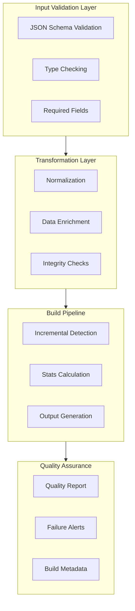
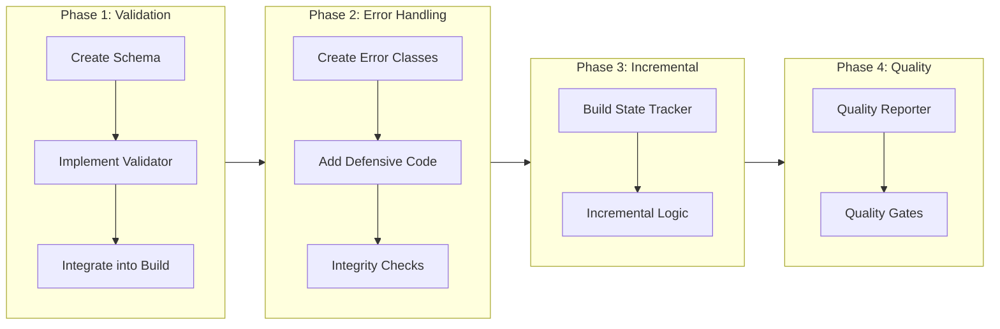

# Data Pipeline Gaps Remediation Plan

## Executive Summary

This document outlines the remediation strategy for critical data pipeline gaps in the Rekonime project. The current data pipeline lacks proper validation, error handling, and quality checks, which can lead to corrupted data, invalid statistics, and poor user experience.

---

## 1. Gap Analysis Summary

### 1.1 Build Process Issues (tools/build-catalogs.js)

| Issue | Location | Severity | Impact |
|-------|----------|----------|--------|
| No input validation on anime.json | Lines 116-124 | 🔴 Critical | Malformed input can crash build or produce invalid output |
| No error handling for malformed anime objects | normalizeAnime() | 🔴 Critical | Invalid objects can propagate through pipeline |
| Build produces invalid stats silently | calculateAllStats() | 🔴 Critical | Users see incorrect retention/completion metrics |
| No incremental builds | Full rebuild every time | 🟡 Medium | Wasted compute, slower development |
| No build metadata tracking | Missing | 🟡 Medium | Cannot trace data lineage or debug issues |

### 1.2 Data Quality Issues (tools/validate-data.js)

| Issue | Current State | Gap | Severity |
|-------|---------------|-----|----------|
| Schema validation | Basic field presence checks | No JSON Schema enforcement | 🔴 Critical |
| Required field enforcement | Partial (id, title, cover) | Missing episode validation | 🔴 Critical |
| Duplicate detection | MalId duplicates only | No ID cross-reference checks | 🟡 Medium |
| Referential integrity | None | No foreign key validation | 🟡 Medium |
| Data type validation | Minimal | No runtime type checking | 🟡 Medium |
| Episode sequence validation | None | Gaps and duplicates allowed | 🟡 Medium |

---

## 2. Remediation Strategy

### 2.1 Architecture Overview



---

## 3. Implementation Tasks

### Phase 1: Input Validation Layer (Critical)

#### Task 1.1: Create JSON Schema for Anime Objects
**Priority:** P0 - Critical  
**Estimated Effort:** Medium  
**Files to Create:**
- `tools/schemas/anime.schema.json` - Main anime schema
- `tools/schemas/episode.schema.json` - Episode sub-schema
- `tools/schemas/metadata.schema.json` - Metadata sub-schema

**Schema Requirements:**
```json
{
  "$schema": "http://json-schema.org/draft-07/schema#",
  "type": "object",
  "required": ["id", "title", "episodes"],
  "properties": {
    "id": { "type": "string", "minLength": 1 },
    "title": { "type": "string", "minLength": 1 },
    "malId": { "type": ["integer", "null"] },
    "anilistId": { "type": ["integer", "null"] },
    "cover": { "type": "string", "format": "uri" },
    "episodes": {
      "type": "array",
      "items": {
        "type": "object",
        "required": ["episode", "score"],
        "properties": {
          "episode": { "type": "integer", "minimum": 1 },
          "score": { "type": "number", "minimum": 1, "maximum": 5 }
        }
      }
    },
    "metadata": { "$ref": "#/definitions/metadata" }
  }
}
```

**Validation Rules:**
- [ ] `id` must be unique across all anime entries
- [ ] `episode` numbers must be sequential (1, 2, 3...) without gaps
- [ ] `score` must be between 1.0 and 5.0
- [ ] `malId` and `anilistId` must be unique if present
- [ ] `cover` must be a valid HTTPS URL
- [ ] `trailer.url` and `trailer.embedUrl` must be valid YouTube URLs

---

#### Task 1.2: Implement Schema Validator Module
**Priority:** P0 - Critical  
**File:** `tools/lib/schema-validator.js`

**Functions:**
- `validateAnimeObject(anime, schema)` - Validate single anime
- `validateCatalog(catalog, schema)` - Validate entire catalog
- `validateEpisodeSequence(episodes)` - Check for gaps/duplicates
- `validateUniqueIds(animeList)` - Check for duplicate IDs

**Error Format:**
```javascript
{
  valid: false,
  errors: [
    {
      animeId: "anime-id",
      field: "episodes[5].score",
      message: "Score must be between 1 and 5",
      value: 5.5,
      severity: "error" // error | warning
    }
  ],
  warnings: [...]
}
```

---

#### Task 1.3: Enhance build-catalogs.js with Validation
**Priority:** P0 - Critical  
**File:** `tools/build-catalogs.js`

**Changes Required:**
```javascript
// Add at line 115 (before processing)
const { validateCatalog } = require('./lib/schema-validator');
const { ValidationError } = require('./lib/errors');

// Validate raw input
const validation = validateCatalog(raw.anime || []);
if (!validation.valid) {
  const criticalErrors = validation.errors.filter(e => e.severity === 'error');
  if (criticalErrors.length > 0) {
    console.error('Build failed due to validation errors:');
    criticalErrors.forEach(err => console.error(`  - ${err.animeId}: ${err.message}`));
    process.exit(1);
  }
}

// Log warnings
if (validation.warnings.length > 0) {
  console.warn('Validation warnings:');
  validation.warnings.forEach(warn => console.warn(`  - ${warn.animeId}: ${warn.message}`));
}
```

---

### Phase 2: Error Handling & Data Integrity

#### Task 2.1: Create Custom Error Classes
**Priority:** P0 - Critical  
**File:** `tools/lib/errors.js`

**Error Types:**
- `ValidationError` - Schema validation failures
- `DataIntegrityError` - Referential integrity violations
- `StatsCalculationError` - Invalid statistics computation
- `BuildError` - General build failures

**Implementation:**
```javascript
class ValidationError extends Error {
  constructor(message, details) {
    super(message);
    this.name = 'ValidationError';
    this.details = details;
    this.severity = 'error';
  }
}

class DataIntegrityError extends Error {
  constructor(message, references) {
    super(message);
    this.name = 'DataIntegrityError';
    this.references = references;
  }
}

module.exports = { ValidationError, DataIntegrityError };
```

---

#### Task 2.2: Implement Defensive Stats Calculation
**Priority:** P0 - Critical  
**File:** `js/stats.js` modifications

**Guard Clauses to Add:**
```javascript
calculateAllStats(anime, scoreProfile) {
  // Validate input
  if (!anime || typeof anime !== 'object') {
    throw new StatsCalculationError('Invalid anime object', { anime });
  }
  
  const episodes = anime.episodes || [];
  
  // Validate episodes array
  if (!Array.isArray(episodes)) {
    throw new StatsCalculationError('Episodes must be an array', { 
      animeId: anime.id,
      episodesType: typeof episodes 
    });
  }
  
  // Validate each episode
  episodes.forEach((ep, index) => {
    if (!ep || typeof ep !== 'object') {
      throw new StatsCalculationError(`Invalid episode at index ${index}`, {
        animeId: anime.id,
        index,
        episode: ep
      });
    }
    if (!Number.isFinite(ep.score) || ep.score < 1 || ep.score > 5) {
      throw new StatsCalculationError(`Invalid score at episode ${ep.episode}`, {
        animeId: anime.id,
        episode: ep.episode,
        score: ep.score
      });
    }
  });
  
  // Continue with existing calculation logic...
}
```

---

#### Task 2.3: Add Referential Integrity Checks
**Priority:** P1 - High  
**File:** `tools/lib/integrity-checker.js`

**Checks to Implement:**
- [ ] Cross-reference malId between anime entries
- [ ] Cross-reference anilistId between anime entries
- [ ] Verify episode count matches metadata.episodes_count
- [ ] Check for orphaned references in related anime

**Implementation:**
```javascript
function checkReferentialIntegrity(animeList) {
  const malIdMap = new Map();
  const anilistIdMap = new Map();
  const issues = [];
  
  animeList.forEach(anime => {
    // Check malId uniqueness
    if (anime.malId) {
      if (malIdMap.has(anime.malId)) {
        issues.push({
          type: 'duplicate-malId',
          malId: anime.malId,
          anime1: malIdMap.get(anime.malId),
          anime2: anime.id
        });
      } else {
        malIdMap.set(anime.malId, anime.id);
      }
    }
    
    // Check episode count consistency
    if (anime.metadata?.episodes_count) {
      const actualEpisodes = anime.episodes?.length || 0;
      if (actualEpisodes !== anime.metadata.episodes_count) {
        issues.push({
          type: 'episode-count-mismatch',
          animeId: anime.id,
          expected: anime.metadata.episodes_count,
          actual: actualEpisodes
        });
      }
    }
  });
  
  return issues;
}
```

---

### Phase 3: Incremental Build System

#### Task 3.1: Create Build State Tracker
**Priority:** P1 - High  
**File:** `tools/lib/build-state.js`

**Features:**
- Store file hashes for input files
- Track last successful build timestamp
- Store dependency graph

**Implementation:**
```javascript
const crypto = require('crypto');
const fs = require('fs');

class BuildState {
  constructor(stateFile = '.build-state.json') {
    this.stateFile = stateFile;
    this.state = this.load();
  }
  
  load() {
    try {
      return JSON.parse(fs.readFileSync(this.stateFile, 'utf8'));
    } catch {
      return { version: 1, files: {}, lastBuild: null };
    }
  }
  
  save() {
    fs.writeFileSync(this.stateFile, JSON.stringify(this.state, null, 2));
  }
  
  getFileHash(filePath) {
    const content = fs.readFileSync(filePath);
    return crypto.createHash('md5').update(content).digest('hex');
  }
  
  hasChanged(filePath) {
    const currentHash = this.getFileHash(filePath);
    const storedHash = this.state.files[filePath]?.hash;
    return currentHash !== storedHash;
  }
  
  updateFile(filePath) {
    this.state.files[filePath] = {
      hash: this.getFileHash(filePath),
      timestamp: Date.now()
    };
  }
  
  markBuildComplete() {
    this.state.lastBuild = Date.now();
    this.save();
  }
}
```

---

#### Task 3.2: Implement Incremental Build Logic
**Priority:** P1 - High  
**File:** `tools/build-catalogs.js`

**Incremental Build Strategy:**
```javascript
async function buildIncremental(inputPath, outputPaths, options = {}) {
  const buildState = new BuildState();
  
  // Check if input has changed
  if (!buildState.hasChanged(inputPath) && !options.force) {
    console.log('No changes detected, skipping build.');
    return { skipped: true };
  }
  
  // Check dependencies (stats.js, etc.)
  const dependencies = ['js/stats.js', 'tools/lib/schema-validator.js'];
  const depsChanged = dependencies.some(dep => buildState.hasChanged(dep));
  
  if (!depsChanged && !buildState.hasChanged(inputPath) && !options.force) {
    console.log('No relevant changes detected, skipping build.');
    return { skipped: true };
  }
  
  // Perform full build
  const result = await performBuild(inputPath, outputPaths);
  
  // Update build state
  buildState.updateFile(inputPath);
  dependencies.forEach(dep => buildState.updateFile(dep));
  buildState.markBuildComplete();
  
  return result;
}
```

---

### Phase 4: Quality Reporting & Monitoring

#### Task 4.1: Create Build Quality Report
**Priority:** P2 - Medium  
**File:** `tools/lib/quality-reporter.js`

**Report Format:**
```javascript
{
  "buildId": "2026-01-29T07:08:03.123Z",
  "duration": 4567,
  "stats": {
    "totalAnime": 250,
    "validAnime": 250,
    "animeWithErrors": 0,
    "animeWithWarnings": 15,
    "totalEpisodes": 3124,
    "averageEpisodesPerAnime": 12.5
  },
  "validation": {
    "schemaErrors": 0,
    "integrityIssues": 2,
    "warnings": [
      {
        "animeId": "some-anime",
        "type": "missing-trailer",
        "message": "Trailer information missing"
      }
    ]
  },
  "statsProfile": {
    "p35": 3.2,
    "p50": 3.6,
    "p65": 4.0,
    "sampleSize": 3124
  }
}
```

---

#### Task 4.2: Integrate Quality Checks into Build
**Priority:** P2 - Medium  
**File:** `tools/build-catalogs.js`

**Quality Gates:**
```javascript
const qualityGates = {
  // Fail build if more than 5% of anime have validation errors
  maxErrorPercentage: 5,
  
  // Warn if average episodes per anime is suspicious
  minAverageEpisodes: 8,
  maxAverageEpisodes: 30,
  
  // Fail if sample size is too small for reliable stats
  minSampleSize: 1000
};

function runQualityGates(report) {
  const gates = [];
  
  // Error percentage gate
  const errorPercentage = (report.stats.animeWithErrors / report.stats.totalAnime) * 100;
  if (errorPercentage > qualityGates.maxErrorPercentage) {
    gates.push({
      name: 'maxErrorPercentage',
      passed: false,
      message: `Error percentage ${errorPercentage.toFixed(1)}% exceeds maximum ${qualityGates.maxErrorPercentage}%`
    });
  }
  
  // Sample size gate
  if (report.statsProfile.sampleSize < qualityGates.minSampleSize) {
    gates.push({
      name: 'minSampleSize',
      passed: false,
      message: `Sample size ${report.statsProfile.sampleSize} below minimum ${qualityGates.minSampleSize}`
    });
  }
  
  return gates;
}
```

---

## 4. Testing Strategy

### 4.1 Unit Tests for Validation
**File:** `test/validation.test.js`

**Test Cases:**
- [ ] Valid anime object passes validation
- [ ] Missing required fields are detected
- [ ] Invalid score values are rejected
- [ ] Duplicate IDs are detected
- [ ] Episode sequence gaps are detected
- [ ] Invalid URLs are rejected
- [ ] Type mismatches are detected

### 4.2 Integration Tests for Build Pipeline
**File:** `test/build-pipeline.test.js`

**Test Cases:**
- [ ] Full build completes successfully
- [ ] Invalid input causes build failure
- [ ] Incremental build skips when no changes
- [ ] Incremental build runs when dependencies change
- [ ] Quality gates block low-quality builds
- [ ] Quality warnings don't fail build

### 4.3 Test Data Fixtures
**Files:**
- `test/fixtures/valid-anime.json` - Valid anime object
- `test/fixtures/invalid-scores.json` - Anime with invalid scores
- `test/fixtures/duplicate-ids.json` - Anime with duplicate IDs
- `test/fixtures/gapped-episodes.json` - Anime with episode gaps

---

## 5. Migration Plan

### Step-by-Step Migration



**Migration Order:**
1. Create schema files (additive, no breaking changes)
2. Create validator module (additive, optional integration)
3. Update build-catalogs.js to use validator (validated integration)
4. Add error handling to stats.js (defensive)
5. Implement incremental build (optimization)
6. Add quality reporting (observability)

---

## 6. Success Metrics

| Metric | Current | Target | Measurement |
|--------|---------|--------|-------------|
| Validation Coverage | 0% | 100% | Schema validation pass rate |
| Build Failures (invalid data) | Silent | Immediate | Error detection timing |
| Data Quality Issues | Unknown | < 2% | Issues per build report |
| Build Time (no changes) | Full rebuild | < 1 second | Time to skip build |
| Stats Calculation Errors | Silent | 0 | Error tracking |
| Test Coverage | 15% | > 80% | Test runner output |

---

## 7. Implementation Checklist

### Phase 1: Input Validation
- [ ] Create `tools/schemas/anime.schema.json`
- [ ] Create `tools/schemas/episode.schema.json`
- [ ] Create `tools/lib/schema-validator.js`
- [ ] Create `tools/lib/errors.js`
- [ ] Update `tools/build-catalogs.js` with validation
- [ ] Add validation unit tests
- [ ] Document validation rules

### Phase 2: Error Handling
- [ ] Add defensive guards to `js/stats.js`
- [ ] Create `tools/lib/integrity-checker.js`
- [ ] Implement referential integrity checks
- [ ] Add error handling integration tests
- [ ] Document error types and handling

### Phase 3: Incremental Builds
- [ ] Create `tools/lib/build-state.js`
- [ ] Implement incremental build logic
- [ ] Add CLI flags (--force, --incremental)
- [ ] Test incremental build scenarios

### Phase 4: Quality Reporting
- [ ] Create `tools/lib/quality-reporter.js`
- [ ] Implement quality gates
- [ ] Add quality report generation
- [ ] Integrate into CI/CD pipeline

---

## 8. Risk Assessment

| Risk | Likelihood | Impact | Mitigation |
|------|------------|--------|------------|
| Strict validation breaks existing data | High | High | Start with warnings, promote to errors gradually |
| Performance impact of validation | Medium | Medium | Cache validation results, incremental builds |
| False positives in duplicate detection | Medium | Medium | Manual review process for edge cases |
| Migration complexity | Medium | High | Incremental rollout, feature flags |

---

## 9. Appendix

### A. Dependencies to Add

```json
{
  "devDependencies": {
    "ajv": "^8.12.0",
    "ajv-formats": "^2.1.1",
    "chalk": "^4.1.2"
  }
}
```

### B. CLI Usage

```bash
# Standard build with validation
node tools/build-catalogs.js

# Force rebuild (ignore incremental state)
node tools/build-catalogs.js --force

# Validation only (no build)
node tools/validate-data.js --strict

# Generate quality report
node tools/build-catalogs.js --report

# Fail on warnings
node tools/build-catalogs.js --strict
```

### C. File Structure After Implementation

```
tools/
├── build-catalogs.js           # Enhanced with validation
├── validate-data.js            # Enhanced validation
├── schemas/
│   ├── anime.schema.json       # Main anime schema
│   ├── episode.schema.json     # Episode schema
│   └── metadata.schema.json    # Metadata schema
└── lib/
    ├── schema-validator.js     # Validation engine
    ├── errors.js               # Error classes
    ├── integrity-checker.js    # Referential integrity
    ├── build-state.js          # Incremental build state
    └── quality-reporter.js     # Quality reporting
```

---

*Document Version: 1.0*  
*Last Updated: 2026-01-29*  
*Status: Draft for Review*
