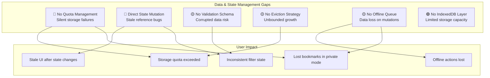
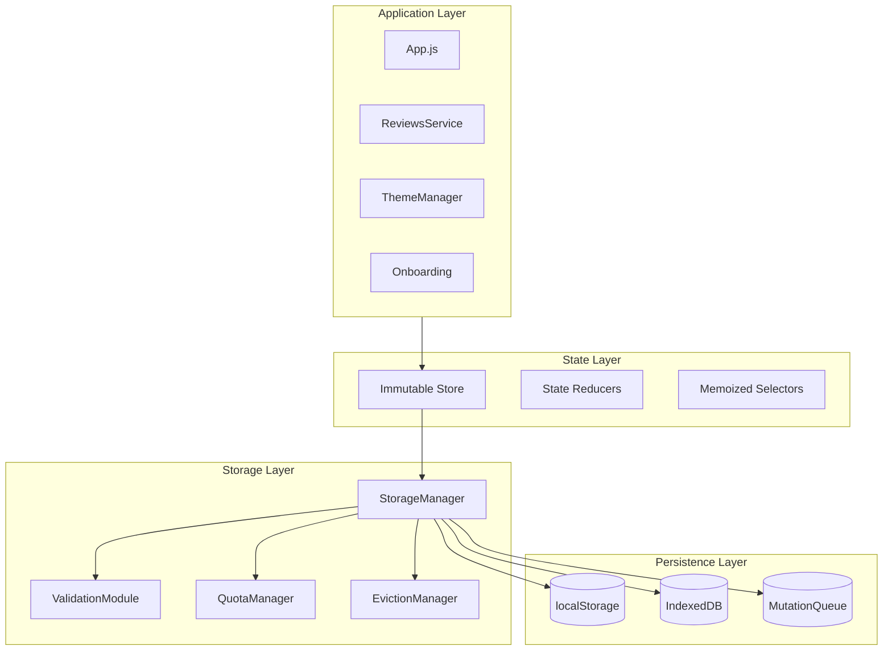
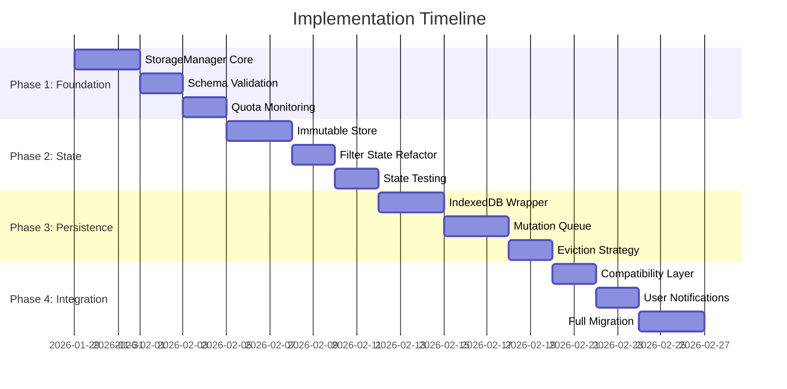

# Data & State Management Refactoring Plan

## Executive Summary

This plan addresses critical gaps in Rekonime's data persistence and state management layer. The current implementation has several architectural weaknesses that could lead to data loss, inconsistent state, and poor user experience.

---

## Current State Analysis

### Storage Usage Audit

| Storage Key | Module | Data Type | Risk Level | Current Issues |
|-------------|--------|-----------|------------|----------------|
| `rekonime.bookmarks` | `app.js` | Array of IDs | Low | No validation, silent failures |
| `rekonime.settings` | `app.js` | JSON object | Low | No schema validation |
| `rekonime.theme` | `themeManager.js` | String | Low | Direct access |
| `rekonime:description:*` | `reviews.js` | Cached text | Medium | 30-day TTL, no eviction |
| `rekonime.onboarding` | `onboarding.js` | Boolean/Progress | Low | No validation |
| `rekonime.tourStep` | `onboarding.js` | Number | Low | No validation |
| `rekonime.shortcutsAcknowledged` | `keyboardShortcuts.js` | Boolean | Low | No validation |
| `rekonime.recMode` | `recommendations.js` | String | Low | Direct access |
| `rekonime.surpriseHistory` | `discovery.js` | Array | Low | No privacy scrubbing |

### Critical Gaps Identified



---

## Proposed Architecture

### Storage Abstraction Layer



---

## Implementation Plan

### Phase 1: Storage Foundation (Priority: Critical)

#### 1.1 StorageManager Module

Create `js/services/storage-manager.js`:

```javascript
// Target API Design
const StorageManager = {
  // Tiered storage with automatic fallback
  async get(key, options = {}),
  async set(key, value, options = {}),
  async remove(key),
  
  // Quota management
  getQuotaStatus(),
  requestQuota(bytes),
  
  // Schema validation
  registerSchema(key, schema),
  validate(key, value),
  
  // Eviction strategies
  setEvictionPolicy(key, policy),
  evictIfNeeded(requiredBytes)
};
```

**Features:**
- Automatic tier selection (memory → localStorage → IndexedDB)
- Configurable TTL with automatic cleanup
- Compression for large values
- Storage failure recovery with user notifications

#### 1.2 Schema Validation Layer

Create `js/services/schema-validator.js`:

```javascript
const schemas = {
  'rekonime.bookmarks': {
    type: 'array',
    items: { type: 'string', minLength: 1 },
    maxItems: 1000
  },
  'rekonime.settings': {
    type: 'object',
    properties: {
      trailerAutoplay: { type: 'boolean' },
      dataSaver: { type: 'boolean' },
      reducedMotion: { type: 'boolean' },
      highContrast: { type: 'boolean' },
      largeText: { type: 'boolean' }
    }
  }
};
```

#### 1.3 Quota Management

Implement proactive quota monitoring:

```javascript
// Track storage usage
const quotaStatus = {
  localStorage: { used: 0, limit: 5 * 1024 * 1024 }, // 5MB typical
  indexedDB: { used: 0, limit: 50 * 1024 * 1024 },   // Request 50MB
  
  async refresh(),
  async canStore(bytes),
  async freeUp(bytes, priority)
};
```

### Phase 2: State Management Refactor (Priority: Critical)

#### 2.1 Immutable State Pattern

Refactor `App.activeFilters` to use immutable updates:

```javascript
// BEFORE (current - problematic)
setActiveFiltersFromUrl({ updateUi = false } = {}) {
    const nextFilters = this.getFiltersFromUrl();
    const changed = !this.areFiltersEqual(this.activeFilters, nextFilters);
    this.activeFilters = nextFilters;  // Direct mutation!
    // ...
}

// AFTER (target - safe)
setActiveFiltersFromUrl({ updateUi = false } = {}) {
    const nextFilters = this.getFiltersFromUrl();
    const changed = !this.areFiltersEqual(this.activeFilters, nextFilters);
    
    // Immutable update
    this.activeFilters = Object.freeze({ 
        ...nextFilters 
    });
    
    // Notify subscribers
    if (changed) {
        this.emit('filters:changed', this.activeFilters);
    }
    // ...
}
```

#### 2.2 Store Module

Create `js/core/store.js`:

```javascript
const Store = {
  state: {},
  subscribers: new Map(),
  
  // Immutable set
  set(path, value) {
    const newState = immutableSet(this.state, path, value);
    const prevState = this.state;
    this.state = Object.freeze(newState);
    this.notify(path, this.state, prevState);
  },
  
  // Subscribe to changes
  subscribe(path, callback),
  
  // Select with memoization
  select(selectorFn)
};
```

### Phase 3: Advanced Persistence (Priority: High)

#### 3.1 IndexedDB Integration

Create `js/services/indexeddb-wrapper.js`:

```javascript
const IndexedDBWrapper = {
  db: null,
  
  async init(),
  async get(storeName, key),
  async set(storeName, key, value),
  async getAll(storeName),
  async clear(storeName),
  
  // Stores
  stores: {
    animeCache: 'cached anime data',
    reviewCache: 'cached reviews',
    mutationQueue: 'pending mutations'
  }
};
```

#### 3.2 Offline Mutation Queue

Create `js/services/mutation-queue.js`:

```javascript
const MutationQueue = {
  // Queue bookmark actions for offline support
  async enqueue(type, payload) {
    // Types: 'bookmark:add', 'bookmark:remove'
    await this.persist({
      id: generateId(),
      type,
      payload,
      timestamp: Date.now(),
      retries: 0
    });
  },
  
  // Process queue when online
  async processQueue(),
  
  // Sync with storage
  async syncBookmarks()
};
```

#### 3.3 Cache Eviction Strategy

Implement LRU eviction for cached descriptions:

```javascript
const evictionPolicies = {
  'rekonime:description:*': {
    strategy: 'lru',           // Least Recently Used
    maxEntries: 100,           // Keep last 100
    maxAge: 30 * 24 * 60 * 60 * 1000, // 30 days
    priority: 'low'            // Evict first if needed
  }
};
```

### Phase 4: Migration & Integration (Priority: Medium)

#### 4.1 Gradual Migration Path

```javascript
// Compatibility layer during migration
const StorageCompat = {
  // Phase 1: Wrap existing localStorage calls
  getItem(key) {
    return StorageManager.get(key, { fallback: 'localStorage' });
  },
  
  // Phase 2: Redirect to new system
  setItem(key, value) {
    return StorageManager.set(key, value, { 
      validate: true,
      compress: true 
    });
  }
};
```

#### 4.2 User Notifications

```javascript
const StorageNotifier = {
  onQuotaExceeded() {
    showToast({
      type: 'warning',
      message: 'Storage nearly full. Older cached data will be removed.',
      action: { label: 'Manage Storage', handler: openStorageSettings }
    });
  },
  
  onStorageError(error) {
    showToast({
      type: 'error',
      message: 'Could not save changes. Please check browser permissions.',
      persistent: true
    });
  }
};
```

---

## File Structure

```
js/
├── core/
│   ├── store.js                 # Immutable state management
│   ├── event-bus.js             # Inter-module communication
│   └── dependency-container.js  # Service injection
├── services/
│   ├── storage-manager.js       # Main storage abstraction
│   ├── schema-validator.js      # Validation layer
│   ├── indexeddb-wrapper.js     # IndexedDB interface
│   ├── mutation-queue.js        # Offline mutation queue
│   └── storage-compat.js        # Migration compatibility
├── domain/
│   └── storage/
│       ├── schemas.js           # Storage schemas
│       ├── eviction-policies.js # Cache policies
│       └── migrations.js        # Data migrations
└── utils/
    ├── immutable.js             # Immutable helpers
    └── storage-helpers.js       # Storage utilities
```

---

## Success Metrics

| Metric | Current | Target | Measurement |
|--------|---------|--------|-------------|
| Storage failures handled | 0% | 100% | Error tracking |
| Silent failures | Yes | No | User notifications |
| Data corruption risk | High | Low | Schema validation |
| Offline bookmark actions | Lost | Queued | Mutation queue |
| Storage quota management | None | Proactive | Quota monitoring |
| State mutation bugs | Present | None | Immutable pattern |

---

## Risk Assessment

| Risk | Likelihood | Impact | Mitigation |
|------|------------|--------|------------|
| Data loss during migration | Low | High | Backup/restore, gradual rollout |
| IndexedDB compatibility | Medium | Medium | localStorage fallback |
| Performance degradation | Low | Medium | Lazy loading, compression |
| Breaking changes | Medium | High | Compatibility layer |

---

## Implementation Order



---

## Next Steps

1. Review and approve this plan
2. Switch to Code mode for implementation
3. Start with Phase 1: StorageManager core
4. Maintain backward compatibility throughout
