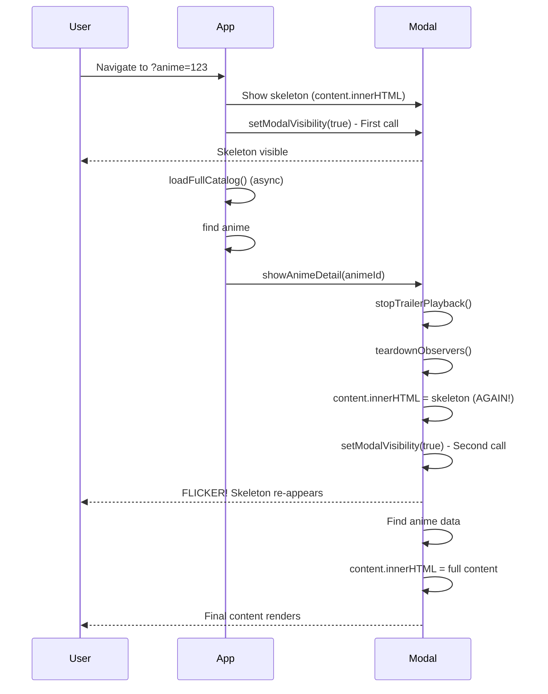

# User Experience Gaps Remediation Plan

## Executive Summary

This document outlines remediation strategies for identified User Experience gaps in the Rekonime application, focusing on three critical areas: Progressive Enhancement, Offline Experience, and Deep Linking stability.

---

## 11.1 Progressive Enhancement Gaps

### Current State Analysis

| Feature | JS Required? | Current Fallback | Gap Impact |
|---------|--------------|------------------|------------|
| **Catalog display** | Yes | Skeleton only | No SSR for SEO; page is blank without JS |
| **Bookmarks** | Yes | None | Blank page without JS |
| **Search** | Yes | None | No server-side or form-based fallback |
| **Filters** | Yes | None | No form-based fallback for no-JS scenarios |

### Gap 11.1.1: Server-Side Rendered (SSR) Catalog

**Severity:** High  
**Impact:** SEO degradation, blank page for no-JS users, poor initial load experience

#### Current Implementation

```javascript
// js/app.js - Catalog rendering is entirely client-side
renderAnimeGrid() {
    const container = document.getElementById('anime-grid');
    if (!container) return;
    container.classList.remove('is-loading');
    // ... JS-dependent rendering
}
```

#### Issues Identified

1. **No static HTML fallback** - [`index.html`](index.html:234-247) contains only skeleton placeholders
2. **SEO impact** - Search engines may not index anime catalog effectively without pre-rendered content
3. **Progressive enhancement violation** - Core content should be accessible without JS

#### Remediation Strategy

**Phase 1: Static HTML Generation (Immediate)**

Create a pre-rendered HTML fallback for the catalog:

```html
<!-- index.html - Add static fallback inside anime-grid -->
<div class="anime-grid" id="anime-grid">
    <!-- Static fallback content for no-JS users -->
    <noscript class="no-js-catalog">
        <div class="no-js-notice">
            <p>JavaScript is required for full functionality. Here are some featured anime:</p>
        </div>
        <!-- Pre-rendered featured anime cards (generated at build time) -->
        <div class="no-js-cards">
            <!-- Build script populates this from anime.full.json -->
        </div>
    </noscript>
    <!-- Skeleton cards (shown while JS loads) -->
    <div class="skeleton-card skeleton-grid"></div>
    <!-- ... -->
</div>
```

**Phase 2: Build-Time Static Generation (Short-term)**

Create a build script to generate static HTML from [`data/anime.full.json`](data/anime.full.json):

```javascript
// tools/generate-static-html.js
const fs = require('fs');
const animeData = JSON.parse(fs.readFileSync('data/anime.full.json'));

// Generate static anime cards for no-JS fallback
const featuredAnime = animeData.anime.slice(0, 12); // Top 12 for no-JS users
const staticCards = featuredAnime.map(anime => `
    <article class="anime-card no-js-card">
        
        <h3>${anime.title}</h3>
        <p>${anime.year || 'Unknown'} · ${anime.studio || 'Unknown'}</p>
        <a href="?anime=${anime.id}">View Details</a>
    </article>
`).join('');

// Inject into index.html template
const indexHtml = fs.readFileSync('index.html', 'utf8');
const updatedHtml = indexHtml.replace(
    '<div class="no-js-cards"></div>',
    `<div class="no-js-cards">${staticCards}</div>`
);
fs.writeFileSync('index.html', updatedHtml);
```

**Phase 3: CSS-Only Enhancements (Medium-term)**

Add CSS to gracefully handle JS/no-JS states:

```css
/* css/styles.css */
.no-js-catalog {
    display: block;
}

.js-loaded .no-js-catalog {
    display: none;
}

.no-js-card {
    /* Basic card styling without JS-dependent features */
}

.no-js-card a {
    /* Visible links for no-JS navigation */
}
```

**Phase 4: Form-Based Filter Fallback (Medium-term)**

Add server-processable form for filter fallback:

```html
<!-- index.html - Add inside filter modal or as separate page -->
<form id="filter-form-fallback" class="filter-fallback" method="GET" action="index.html">
    <fieldset>
        <legend>Genre</legend>
        <label><input type="checkbox" name="genre" value="Action"> Action</label>
        <!-- Generated at build time from filter options -->
    </fieldset>
    <!-- More filter categories... -->
    <button type="submit">Apply Filters</button>
</form>
```

---

### Gap 11.1.2: Bookmarks Page No-JS Fallback

**Severity:** Medium  
**Impact:** Users without JS see completely blank bookmarks page

#### Current Implementation

```html
<!-- bookmarks.html lines 68-70 -->
<div class="anime-grid bookmarks-grid" id="bookmarks-grid"></div>
<p class="bookmarks-empty" id="bookmarks-empty">No bookmarks yet...</p>
```

All bookmark rendering is in [`js/app.js`](js/app.js:914-929) and requires JavaScript.

#### Remediation Strategy

**Phase 1: No-JS Notice with Instructions**

```html
<!-- bookmarks.html - Add no-JS fallback -->
<section class="bookmarks-section is-empty" id="bookmarks-section">
    <noscript>
        <div class="bookmarks-no-js">
            <h2>Bookmarks</h2>
            <p>JavaScript is required to view and manage your bookmarks.</p>
            <p>To save anime for later:</p>
            <ol>
                <li>Enable JavaScript in your browser</li>
                <li>Browse the <a href="index.html">catalog</a></li>
                <li>Click the star icon on any anime card</li>
            </ol>
        </div>
    </noscript>
    <!-- ... existing content -->
</section>
```

**Phase 2: Static Bookmark List via URL Parameters (Optional Enhancement)**

For advanced no-JS support, allow bookmark IDs in URL:

```html
<!-- bookmarks.html -->
<script>
    // If URL contains ?bookmarks=id1,id2,id3, server could pre-render
    // This requires backend support or edge function
</script>
```

---

### Gap 11.1.3: Search Form Fallback

**Severity:** Medium  
**Impact:** No search capability for no-JS users

#### Current Implementation

```javascript
// js/app.js lines 1798-1839 - Entirely JS-dependent
setupHeaderSearch() {
    const headerSearch = document.getElementById('header-search');
    headerSearch.addEventListener('input', (e) => {
        this.handleHeaderSearch(e.target.value);
    });
}
```

#### Remediation Strategy

**Phase 1: Traditional Form with GET Method**

```html
<!-- index.html - Wrap search in form -->
<div class="header-search-wrapper">
    <form action="index.html" method="GET" class="search-form">
        <input type="text" 
               name="search" 
               id="header-search" 
               class="header-search-input" 
               placeholder="Search anime..."
               aria-label="Search anime">
        <noscript>
            <button type="submit" class="search-submit">Search</button>
        </noscript>
    </form>
    <div class="header-search-dropdown" id="header-search-dropdown">
        <!-- JS-only: populated dynamically -->
    </div>
</div>
```

**Phase 2: URL-Based Search Parameter Handling**

```javascript
// js/app.js - Add URL search param support
handleUrlSearch() {
    const urlParams = new URLSearchParams(window.location.search);
    const searchQuery = urlParams.get('search');
    if (searchQuery) {
        // Filter catalog to matching items and display
        this.filteredData = this.animeData.filter(anime => 
            anime.title.toLowerCase().includes(searchQuery.toLowerCase())
        );
        this.render();
    }
}
```

---

## 11.2 Offline Experience Gaps

### Current State Analysis

The Service Worker ([`sw.js`](sw.js:1-255)) provides basic caching:
- Static assets: Cache First strategy
- Data JSON: Cache First with background update
- Images: Stale While Revalidate
- API calls: Network First with cache fallback

### Gap 11.2.1: Search Indexes Not Cached

**Severity:** High  
**Impact:** Search functionality fails or degrades significantly when offline

#### Current Implementation

```javascript
// js/app.js lines 1416-1484 - Search operates on in-memory data
findSearchMatches(query) {
    const queryInfo = this.prepareSearchQuery(query);
    const results = [];
    for (const anime of this.animeData) {
        const index = this.getSearchIndex(anime);
        const score = this.scoreSearchMatch(index, queryInfo);
        // ...
    }
}
```

#### Issues Identified

1. Search requires full anime data to be loaded in memory
2. If offline and data not cached, search fails completely
3. No dedicated search index for efficient offline search
4. Search indexes are computed on-the-fly, not persisted

#### Remediation Strategy

**Phase 1: Pre-computed Search Index in Data Pipeline**

Modify [`tools/build-catalogs.js`](tools/build-catalogs.js) to generate search index:

```javascript
// Add to build-catalogs.js
function buildSearchIndex(animeList) {
    const index = {
        byTitle: {},        // title word -> [animeIds]
        byGenre: {},        // genre -> [animeIds]
        byTheme: {},        // theme -> [animeIds]
        byStudio: {},       // studio -> [animeIds]
        suggestions: []     // pre-computed suggestions
    };
    
    animeList.forEach(anime => {
        // Index by title tokens
        const titleTokens = anime.title.toLowerCase().split(/\s+/);
        titleTokens.forEach(token => {
            if (!index.byTitle[token]) index.byTitle[token] = [];
            index.byTitle[token].push(anime.id);
        });
        
        // Index by genres
        anime.genres?.forEach(genre => {
            if (!index.byGenre[genre]) index.byGenre[genre] = [];
            index.byGenre[genre].push(anime.id);
        });
        
        // Similar for themes, studios...
    });
    
    return index;
}

// Include in anime.full.json output
const payload = {
    generatedAt: new Date().toISOString(),
    scoreProfile: profile,
    searchIndex: buildSearchIndex(catalog),
    anime: catalog
};
```

**Phase 2: Service Worker Search Index Caching**

```javascript
// sw.js - Add search index to cache
const STATIC_ASSETS = [
    // ... existing assets
    './data/anime.full.json',
    './data/anime.preview.json'
];

// Add background sync for search index updates
async function cacheSearchIndex() {
    const cache = await caches.open(DATA_CACHE);
    // Ensure search index is always available offline
    const indexRequest = new Request('./data/anime.full.json');
    const response = await fetch(indexRequest);
    if (response.ok) {
        await cache.put(indexRequest, response);
    }
}
```

**Phase 3: Offline-Aware Search in App**

```javascript
// js/app.js - Enhance search for offline
findSearchMatches(query) {
    // Check if we have data
    if (!this.animeData || this.animeData.length === 0) {
        // Try to load from cache
        return this.searchFromCache(query);
    }
    // ... existing implementation
}

async searchFromCache(query) {
    // Use cached search index if main data unavailable
    const cache = await caches.open('rekonime-data-v1');
    const cached = await cache.match('./data/anime.full.json');
    if (cached) {
        const data = await cached.json();
        // Search using pre-computed index
        return this.searchUsingIndex(query, data.searchIndex);
    }
    return [];
}
```

---

### Gap 11.2.2: No Offline Indicator for Partial Functionality

**Severity:** Medium  
**Impact:** Users don't understand what features are available when offline

#### Current Implementation

```javascript
// js/serviceWorker.js lines 127-150 - Basic offline indicator
showOfflineIndicator() {
    let indicator = document.getElementById('offline-indicator');
    if (!indicator) {
        indicator = document.createElement('div');
        indicator.id = 'offline-indicator';
        indicator.className = 'offline-indicator';
        indicator.innerHTML = '📡 Offline Mode - Using cached data';
        document.body.appendChild(indicator);
    }
    indicator.classList.add('visible');
}
```

#### Issues Identified

1. Generic message doesn't communicate feature availability
2. No indication of which features work offline vs. require network
3. No degradation of UI for offline-incompatible features

#### Remediation Strategy

**Phase 1: Feature-Aware Offline Indicator**

```javascript
// js/serviceWorker.js - Enhanced offline indicator
showOfflineIndicator() {
    const indicator = document.getElementById('offline-indicator');
    if (indicator) {
        indicator.innerHTML = `
            <span class="offline-icon">📡</span>
            <div class="offline-content">
                <span class="offline-title">You're offline</span>
                <span class="offline-features">
                    Browse: ✓ | Search: ✓ | Details: ✓ | Reviews: ✗
                </span>
            </div>
        `;
        indicator.classList.add('visible');
    }
}
```

**Phase 2: UI Degradation for Offline**

```css
/* css/styles.css */
[data-offline="true"] .feature-online-only {
    opacity: 0.5;
    pointer-events: none;
    position: relative;
}

[data-offline="true"] .feature-online-only::after {
    content: "(Unavailable offline)";
    position: absolute;
    bottom: 0;
    left: 0;
    right: 0;
    background: var(--bg-secondary);
    padding: 0.25rem;
    font-size: 0.75rem;
    text-align: center;
}

/* Disable reviews section when offline */
[data-offline="true"] #community-reviews-section {
    display: none;
}
```

**Phase 3: Offline Capability Detection**

```javascript
// js/serviceWorker.js - Add capability checking
const OfflineCapabilities = {
    canBrowse: () => true, // Always works with cached data
    canSearch: () => hasCachedData(), // Needs anime data
    canViewDetails: (animeId) => hasAnimeInCache(animeId),
    canViewReviews: () => false, // Requires live API
    canBookmark: () => true, // Local storage works offline
    
    async hasCachedData() {
        const cache = await caches.open('rekonime-data-v1');
        const cached = await cache.match('./data/anime.full.json');
        return !!cached;
    }
};
```

---

### Gap 11.2.3: Bookmark Actions Not Queued for Sync

**Severity:** High  
**Impact:** Bookmark toggles fail silently when offline; data loss risk

#### Current Implementation

```javascript
// js/app.js lines 861-873 - No offline handling
toggleBookmark(animeId) {
    const key = String(animeId ?? '').trim();
    if (!key) return;
    
    if (this.isBookmarked(key)) {
        this.removeBookmark(key);
    } else {
        this.addBookmark(key);
    }
    // ... updates UI
}

// js/app.js lines 826-835 - Direct localStorage save
saveBookmarks() {
    if (typeof window === 'undefined') return;
    const storage = this.getBookmarkStorage();
    if (!storage) return;
    try {
        storage.setItem(this.bookmarkStorageKey, JSON.stringify(this.bookmarkIds));
    } catch (error) {
        // Ignore storage errors - no retry or queuing
    }
}
```

#### Issues Identified

1. `localStorage` operations assumed to always succeed
2. No handling for quota exceeded errors
3. No sync mechanism when coming back online
4. No user feedback when bookmark operations fail

#### Remediation Strategy

**Phase 1: Background Sync Integration**

```javascript
// js/app.js - Enhanced bookmark persistence
const BookmarkSync = {
    pendingKey: 'rekonime.pendingBookmarks',
    
    async queueBookmarkAction(action, animeId) {
        // Always update local state first (optimistic)
        this.updateLocalState(action, animeId);
        
        // Try to save immediately
        const saved = await this.persistBookmarks();
        
        if (!saved && 'sync' in ServiceWorkerManager.registration) {
            // Queue for background sync
            await this.queueForSync(action, animeId);
        }
    },
    
    async queueForSync(action, animeId) {
        const pending = JSON.parse(localStorage.getItem(this.pendingKey) || '[]');
        pending.push({ action, animeId, timestamp: Date.now() });
        localStorage.setItem(this.pendingKey, JSON.stringify(pending));
        
        // Register for background sync
        try {
            await ServiceWorkerManager.registration.sync.register('sync-bookmarks');
        } catch (e) {
            console.log('[BookmarkSync] Sync registration failed:', e);
        }
    }
};
```

**Phase 2: Service Worker Background Sync Handler**

```javascript
// sw.js - Add background sync handling
self.addEventListener('sync', (event) => {
    if (event.tag === 'sync-bookmarks') {
        event.waitUntil(syncPendingBookmarks());
    }
});

async function syncPendingBookmarks() {
    // This would sync with a server if backend existed
    // For now, just clear pending queue as localStorage is source of truth
    const pending = JSON.parse(localStorage.getItem('rekonime.pendingBookmarks') || '[]');
    
    for (const action of pending) {
        // Validate action and apply if needed
        console.log('[SW] Processing pending bookmark:', action);
    }
    
    localStorage.removeItem('rekonime.pendingBookmarks');
}
```

**Phase 3: User Feedback for Offline Operations**

```javascript
// js/app.js - Enhanced bookmark toggle with feedback
async toggleBookmark(animeId) {
    const key = String(animeId ?? '').trim();
    if (!key) return;
    
    const wasBookmarked = this.isBookmarked(key);
    
    // Optimistic update
    if (wasBookmarked) {
        this.removeBookmark(key);
    } else {
        this.addBookmark(key);
    }
    
    // Try to persist
    const saved = await this.saveBookmarksWithFeedback();
    
    if (!saved) {
        // Revert optimistic update
        if (wasBookmarked) {
            this.addBookmark(key);
        } else {
            this.removeBookmark(key);
        }
        this.showBookmarkError('Failed to save bookmark. Please try again.');
    } else if (ServiceWorkerManager.isOffline()) {
        this.showBookmarkSuccess('Bookmark saved locally. Will sync when online.');
    }
}
```

---

## 11.3 Deep Linking Issues

### Gap 11.3.1: Race Condition in Deep Link Handling

**Severity:** High  
**Impact:** Flickering UI, poor perceived performance, user confusion

#### Current Implementation

```javascript
// js/app.js lines 4252-4288 - handleDeepLink
async handleDeepLink(animeId) {
    const modal = document.getElementById('detail-modal');
    const content = document.getElementById('detail-content');

    if (!modal || !content) return false;

    // Show modal immediately with skeleton for perceived performance
    content.innerHTML = this.renderDetailSkeleton();
    this.setModalVisibility('detail-modal', true, { initialFocusSelector: '#close-detail' });

    // Try to find anime in preview data first
    let anime = this.animeData.find(a => a.id === animeId);

    // If not found and we don't have full data yet, try to load it
    if (!anime && !this.isFullDataLoaded) {
        const fullLoaded = await this.loadFullCatalog();
        if (fullLoaded) {
            anime = this.animeData.find(a => a.id === animeId);
        }
    }

    if (anime) {
        // Render full detail with actual data
        this.showAnimeDetail(animeId, { updateUrl: false }); // <-- DOUBLE RENDER!
        return true;
    } else {
        // Show error...
    }
}
```

#### Issues Identified

1. **Double modal visibility change** - [`setModalVisibility`](js/app.js:738-752) called twice (lines 4260 and 4276)
2. **Content replacement race** - Skeleton rendered at line 4259, then [`showAnimeDetail`](js/app.js:3546-3757) clears and re-renders at line 4276
3. **Focus management conflict** - Focus set twice potentially causing accessibility issues
4. **URL update inconsistency** - `updateUrl: false` in deep link but URL may already have anime parameter

#### Root Cause Flow



#### Remediation Strategy

**Phase 1: Unified Modal Rendering State Machine**

Refactor to use a single render path with state tracking:

```javascript
// js/app.js - Refactored deep link handling
const ModalState = {
    IDLE: 'idle',
    LOADING: 'loading',
    READY: 'ready',
    ERROR: 'error'
};

async handleDeepLink(animeId) {
    // Set state to loading
    this.setModalState(ModalState.LOADING, { animeId });
    
    // Try to find anime
    let anime = this.animeData.find(a => a.id === animeId);
    
    // Load full catalog if needed
    if (!anime && !this.isFullDataLoaded) {
        await this.loadFullCatalog();
        anime = this.animeData.find(a => a.id === animeId);
    }
    
    if (anime) {
        this.setModalState(ModalState.READY, { anime });
    } else {
        this.setModalState(ModalState.ERROR, { 
            message: 'Anime not found',
            animeId 
        });
    }
}

setModalState(state, data) {
    const content = document.getElementById('detail-content');
    const modal = document.getElementById('detail-modal');
    
    switch (state) {
        case ModalState.LOADING:
            // Only render skeleton if not already visible
            if (!modal.classList.contains('visible')) {
                content.innerHTML = this.renderDetailSkeleton();
                this.setModalVisibility('detail-modal', true, { 
                    initialFocusSelector: '#close-detail' 
                });
            }
            break;
            
        case ModalState.READY:
            // Render actual content without closing/reopening modal
            this.renderAnimeDetail(data.anime);
            this.currentAnimeId = data.anime.id;
            break;
            
        case ModalState.ERROR:
            content.innerHTML = this.renderDetailError(data);
            break;
    }
}
```

**Phase 2: Remove Redundant Modal Operations**

```javascript
// js/app.js - Modified showAnimeDetail for use in deep link
showAnimeDetail(animeId, { 
    updateUrl = true, 
    skipModalOpen = false  // New option
} = {}) {
    // ... existing setup
    
    // Only show skeleton if modal not already open
    if (!skipModalOpen) {
        content.innerHTML = this.renderDetailSkeleton();
        this.setModalVisibility('detail-modal', true, { 
            initialFocusSelector: '#close-detail' 
        });
    }
    
    // ... rest of rendering
}

// Then in handleDeepLink:
async handleDeepLink(animeId) {
    // ... find anime
    if (anime) {
        // Pass skipModalOpen since we already opened it
        this.showAnimeDetail(animeId, { 
            updateUrl: false,
            skipModalOpen: true  // Prevent double modal open
        });
    }
}
```

**Phase 3: Content Transition Animation**

Add CSS transitions to smooth the skeleton-to-content transition:

```css
/* css/styles.css */
.detail-skeleton {
    animation: skeleton-pulse 1.5s ease-in-out infinite;
}

@keyframes skeleton-pulse {
    0%, 100% { opacity: 1; }
    50% { opacity: 0.7; }
}

.detail-content-loaded {
    animation: content-fade-in 0.3s ease-out;
}

@keyframes content-fade-in {
    from { opacity: 0; transform: translateY(10px); }
    to { opacity: 1; transform: translateY(0); }
}
```

---

## Implementation Priority Matrix

| Gap | Severity | Effort | Priority | Phase |
|-----|----------|--------|----------|-------|
| 11.1.1 SSR Catalog | High | High | P1 | Short-term |
| 11.1.3 Search Fallback | Medium | Low | P2 | Immediate |
| 11.2.1 Search Index Cache | High | Medium | P1 | Short-term |
| 11.2.3 Bookmark Sync | High | Medium | P1 | Short-term |
| 11.3.1 Deep Link Race | High | Medium | P0 | Immediate |
| 11.1.2 Bookmarks Fallback | Medium | Low | P3 | Medium-term |
| 11.2.2 Offline Indicator | Medium | Low | P2 | Immediate |

---

## Success Metrics

| Metric | Current | Target | Measurement |
|--------|---------|--------|-------------|
| No-JS content visibility | 0% | 80%+ | Manual test with JS disabled |
| Offline search capability | None | Full | Test search in airplane mode |
| Deep link flicker | Present | None | Visual inspection, <100ms transition |
| Bookmark offline reliability | 0% | 100% | Test bookmark toggle offline |
| Offline feature clarity | None | Clear indicators | User testing |

---

## Testing Strategy

### No-JS Testing Checklist
- [ ] Catalog page displays content without JavaScript
- [ ] Search form submits via GET without JavaScript
- [ ] Filter form works without JavaScript
- [ ] Bookmarks page shows helpful message without JavaScript

### Offline Testing Checklist
- [ ] App loads and displays cached catalog when offline
- [ ] Search works with cached data when offline
- [ ] Bookmark operations queue and persist when offline
- [ ] Offline indicator clearly shows feature availability
- [ ] Coming back online triggers pending sync operations

### Deep Link Testing Checklist
- [ ] Direct URL with `?anime=id` opens modal without flicker
- [ ] Modal opens immediately with skeleton
- [ ] Content transitions smoothly from skeleton to full detail
- [ ] Back button works correctly after deep link navigation
- [ ] Focus management is correct throughout transition

---

## Document Control

| Version | Date | Author | Changes |
|---------|------|--------|---------|
| 1.0 | 2026-01-29 | Architect | Initial remediation plan |

---

*This document is a living specification. Update as implementation progresses.*
